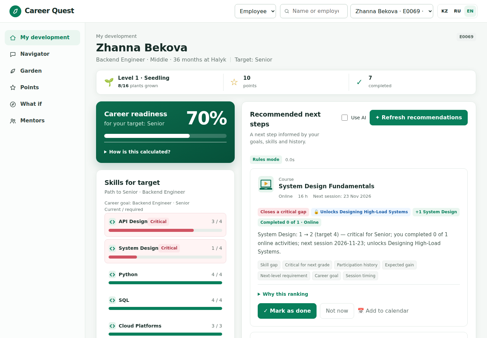
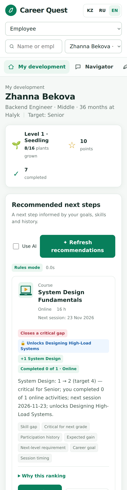
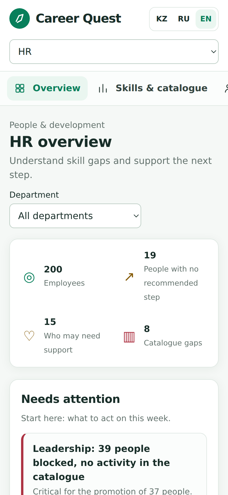
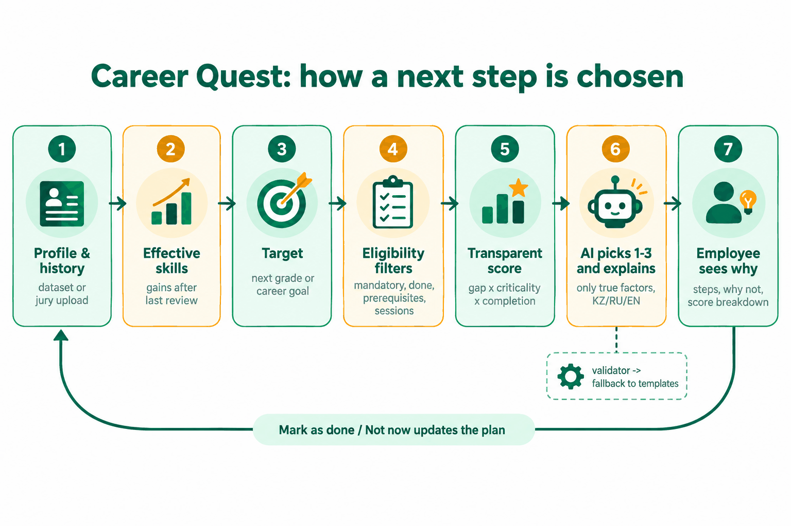

# Career Quest — AI navigator for employee development

[Русский](README.md) · **English** · [Қазақша](README.kk.md)

HackAlem AI 2026 · **Track 03 · Management · Career Quest case (Halyk Bank)** — "an employee lifecycle gamification platform". Team Nyanachi.

## Summary

Employees receive career events as scattered notifications and cannot see where each activity leads, so training is completed as a formality. **Career Quest** shows the employee the path to the next grade and suggests 1–3 next steps with an explanation of "why this one", based on several factors at once: skill gaps relative to the requirements of the next grade, how critical a skill is for promotion, participation history (no-shows, declines, abandoned activities by format) and the expected skill gain. HR sees which skills lag most often, who has no available next step, and how activities are going.

Users: employees with 1–5 years of tenure (primary) and HR / managers.

## Quick start

```bash
git clone https://github.com/BAITC-Hacks/hack-34398b15-nyanachi.git
cd hack-34398b15-nyanachi
./run.sh                 # Python 3.12+; open http://127.0.0.1:8000
```

- Without an API key everything works in rules mode; for AI explanations — `cp .env.example .env` and set `OPENAI_API_KEY`.
- The interface opens in English; switch KZ / RU / EN at the top right.
- Employee screen: select `E0001` → "Recommend next steps" → "Mark as done".
- Explanations are written in the employee's language (`preferred_language`): Kazakh for `E0001`, Russian for `E0002`.
- HR screen: "View" switch → "HR", **password `hr-demo`** (variable `HR_PASSWORD`).
- Checks: `.venv/bin/python -m pytest -q` (26 tests) and `.venv/bin/python -m eval.run_benchmark` (9/9).

## Screenshots




Mobile: employee and HR:

<p>


</p>

## What is implemented

Mandatory case requirements:

| Requirement | Where to look |
|---|---|
| Profile and trajectory: role, grade, skills, completed activities, available steps | Employee screen: "Career readiness" card (percentage of readiness for the goal), "Skills for target" — "current / required" bars, critical skills highlighted |
| AI recommendation of 1–3 next steps | "Recommend next steps" button (`POST /api/employees/{id}/recommend`) |
| Explanation based on at least 3 factors | Explanation text + factor tags + chips with numbers (gap, criticality, gain, "completed X of Y in this format") |
| Progress update | "Mark as done" → skill gain respecting `max_level`, recalculation of grade readiness and recommendations |
| Simple HR screen | Lagging skills, employees without a recommended step (with the reason), participation by activity |
| Upload of additional profiles and history in the dataset format (a minimal profile as in the case example — `employee_id, role, grade, tenure_months, skills` — is also accepted) | HR screen → upload `employees.json` / `activity_history.csv` (`POST /api/data/upload`) |
| Available next steps on the profile | "Available next steps" list with format, nearest session and skill gains |

Beyond the mandatory scope:
- **AI navigator (chat with an agent)** — the employee asks "why is this step first?", "who could be my mentor?", "what do I need for Lead?". The agent (`gpt-6-sol`, function calling) calls the engine's tools itself — profile overview, recommendations, options for a skill, activity explanation, path simulation, mentors — and answers only from their results. The tools are restricted to the data of the single logged-in employee; the interface shows which tools were used.
- **How readiness is calculated** — an expandable calculation: credited levels / required levels and a list of missing levels per skill.
- **"Not now" with a reason** — "inconvenient format", "no time", "not interested". The activity is hidden; the "format" reason lowers the weight of that format in subsequent recommendations. No penalties — participation is voluntary.
- **"Why not the obvious choice"** — an explanation of why the weakest skill was not chosen (for example, "you skipped similar activities three times, and the skill is not critical for Senior").
- **Prerequisite chains** — if a valuable activity is locked behind a prerequisite, the system recommends the step that unlocks it ("unlocks Designing High-Load Systems").
- **Gaps that cannot be closed** — critical skills for which the catalogue has no available activity; the employee is offered to discuss mentoring, and HR sees the gap in the catalogue.
- **Benchmark on traps** — 9 profiles on which the "lowest skill" rule is wrong: baseline rule 0/9, Career Quest 9/9.
- Explanations in the employee's language (kk / ru / en per `preferred_language`), interface in KZ / RU / EN; the names of the 60 skills, 40 activities and 8 roles are translated into Kazakh and Russian (`web/i18n_names.json`; the dataset itself is unchanged).

Optional case items:
- **Grade transition simulation** — "What if": the system takes the best step, applies the skill gains and re-plans (up to 5 steps) with the dates of the nearest sessions in order. Example: E0001 — readiness 54.5% → 75.8% by December. Nothing is saved.
- **Extended HR dashboard** — department filter and "catalogue gaps": skills employees need for their goal that no available activity can raise (for example, Leadership is needed by 39 employees and critical for the promotion of 37, but there is no course).
- **Mentoring** — for the largest gaps, the system finds colleagues from the same department at Senior/Lead level who are strong in that skill and willing to mentor (Mentoring ≥ 3 or completed Mentor Track). Only name and role are shown; colleagues' skill levels are not disclosed.
- **Internal currency and rewards** — points only for voluntary activities (+10 per activity, +10 per skill level gained); mandatory training gives no points; a rewards catalogue and point redemption. Only the employee sees their own balance.
- **Personal challenges** — a voluntary goal from the simulated path ("reach API Design 3 by November 23"), +50 points on completion.
- **Activity builder for HR** — in the "catalogue gaps" table, a "Create activity" button: the system fills in a draft for the roles and grades of the blocked employees (for example, Leadership — 39 people), HR edits and publishes it, the activity immediately enters recommendations, and the gap is closed.
- **Who needs support (instead of "attrition risk")** — HR sees clear signals without a hidden score: no-shows over the year, overdue mandatory training, no completed activities for 6 months, no career goal, Junior for a long time — and a suggested action (ask about format, check workload, offer a mentor, talk about goals). HR only.
- **Peer recognition** — "Say thanks" to a mentor from one's own department: the recipient sees the thanks and +15 points; no more than 3 thanks per day and one to the same colleague per week; nothing is published.
- **Team goal** — overall department progress (completed voluntary activities over 90 days versus one per person), anonymous and without comparing people.
- **Speed** — recommendations appear instantly in rules mode first, then are replaced by the AI version; the AI response is cached by profile state and prefetched when the profile is opened.
- **Skill garden and level** — each goal skill is shown as a plant, growth stage = actual skill level (0–5); the personal level (Seedling → Forest keeper) grows with points. The garden can be shown to colleagues from one's own department only by mutual consent; there are no rankings. Plant images were generated with `gpt-image-2.5` during the hackathon.
- Works **without an API key** (rules mode) with template explanations.

## How the solution works



1. **Loading** of the starter dataset (`data/`) and, if needed, additional profiles and history; the schema is validated with Pydantic models.
2. **Effective skills.** Skill levels reflect the latest review, so gains from activities completed after `last_review_date` are added to them (capped by `max_level`).
3. **Goal.** `career_goal` if set (including in another role), otherwise the next grade of the current role; for a Lead without a goal — the critical skills of the current grade.
4. **Availability filters.** Excluded: mandatory activities, already completed ones (except the repeatable `EV_036`), activities in progress, those not matching role/grade, with unmet prerequisites, without future sessions, and without remaining skill gain.
5. **Scoring** of each available activity with a transparent formula (below) + a bonus for unlocking a valuable activity via a prerequisite.
6. **AI layer.** `gpt-6-sol` receives the top 6 candidates with computed factors and selects 1–3 steps, writing the explanation in the employee's language (Structured Outputs, strict JSON schema). The validator checks: 1–3 steps, only IDs from the candidate list, ≥3 factors per step. `gpt-6-luna` runs in parallel as a fallback; if neither model responds correctly within 8.5 s, template explanations are used. Typical response time is 5–7 s (case requirement ≤10 s).
7. **Progress.** "Mark as done" adds a record to the history; skills and readiness are recalculated.

### Recommendation reliability

- Only useful steps are recommended — those that close a gap to the goal or unlock such an activity; "1–3" means up to three, without filling slots with useless ones. If there are no useful steps, the employee sees "talk about mentoring", and HR sees this employee with the reason.
- An activity the employee has declined twice is no longer suggested; the repeatable club (`EV_036`) is credited at most once a day.
- Gains from completed activities are counted once: the "done" mark does not overwrite the review date, so the gain is not doubled.
- The AI can only claim factors that are actually true for the activity (for example, "critical for grade" — only if the step closes a critical gap). Unconfirmed factors are discarded; if fewer than three remain, the template explanation is used.
- For a role change (goal in another role), the target role's base activities up to and including the target grade are eligible.
- The AI cannot make the engine's choice worse: the response must include the step with the highest score, an avoided format cannot be chosen when an alternative exists, and at least one factor must not be derived from the gap (history, format, timing, goal, criticality). Otherwise — the template explanation.
- "Mark as done" accepts only eligible activities: repeating a completed one, a mandatory one, a different role/grade, or unmet prerequisites — 422.
- Activities "in progress" are not recommended again but are shown as "finish what you started".
- Each card has an expandable "Why this ranking" — the contribution of each part of the formula to the final score.
- 26 tests; one of them checks all 200 employees and the trap profiles: steps are eligible, non-mandatory, non-repeated, deterministic, and have ≥3 confirmed factors.

### Scoring formula

```
useful_gain(skill) = min(new_level, required) − current        # new_level = min(current + gain, max_level)
gap_points  = Σ useful_gain × (2 if the skill is critical for the goal, else 1)
reliability = 0.7 × completion_rate(format) + 0.3 × completion_rate(type)   # rate = (completed+1)/(completed+skipped+2)
score = (gap_points + 0.2 × gain_above_requirement) × (0.2 + 0.8 × reliability)
        × 0.6 if the format is avoided (≥3 skips and 0 completions)
        × 0.9 / 1.05 if the employee's average rating of this activity type is ≤2.5 / ≥4.5
        − 0.25 × max(0, similar_skips − 1) − 0.01 × hours − 0.15 if the nearest session is more than 90 days away
        + 0.5 × score_of_locked_activity if the step unlocks its prerequisite
goal readiness, % = Σ min(level, required) / Σ required
```

## Technologies

- Python 3.12, FastAPI, Pydantic, Uvicorn
- OpenAI API: `gpt-6-sol` (primary model), `gpt-6-luna` (fast fallback), Responses API with Structured Outputs
- Interface: a single HTML/CSS/JS file with no build step and no external CDNs (works inside a closed network)
- pytest

## AI cost (estimate)

Tokens were measured on real calls: one AI recommendation ≈ 2,050 input and ≈ 300 output tokens (`gpt-6-sol` + the parallel `gpt-6-luna` fallback), one navigator question ≈ 2,050 / 170 tokens (2–3 model calls in the tool loop). Prices: `gpt-6-sol` $2 / $10, `gpt-6-luna` $0.10 / $0.50 per 1M tokens.

| | Per employee per month | 40 employees | 1,000 | 15,000 |
|---|---|---|---|---|
| Normal usage: 8 new AI recommendations + 10 navigator questions | ≈ $0.12 | ≈ $5 | ≈ $117 | ≈ $1,760 |
| Active usage (×3) | ≈ $0.35 | ≈ $14 | ≈ $350 | ≈ $5,270 |
| `gpt-6-luna` only (`OPENAI_MODEL=gpt-6-luna`) | ≈ $0.006 | < $1 | ≈ $6 | ≈ $87 |
| Rules mode (no key) | $0 | $0 | $0 | $0 |

- On the HR screen, the "AI budget" block recalculates these amounts for any headcount and shows the tokens actually spent on this server.
- Repeat views cost nothing: the AI response is cached by profile state; a new call happens only after "done", "not now" or a new activity.
- For a closed network: `OPENAI_BASE_URL` points to Qwen in vLLM inside the bank — a fixed GPU cost instead of per-token billing, and data does not leave the bank.

## Architecture

```mermaid
flowchart LR
    D[data/*.json, *.csv<br/>+ HR/jury upload] --> L[app/data.py<br/>loading and validation]
    L --> E[app/engine.py<br/>effective skills · goal · filters · scoring · chains · HR statistics]
    E --> A[app/agent.py<br/>gpt-6-sol ‖ gpt-6-luna → validator → templates]
    E --> API
    A --> API[app/main.py<br/>FastAPI, employee / HR roles]
AGENTS.md       guide for AI coding agents (Codex, Claude Code): run, verify, invariants
    API --> W[web/index.html<br/>employee screen · HR screen]
```

```
app/config.py   settings from the environment
app/data.py     data models, dataset loading and merging
app/engine.py   deterministic core: all numbers the AI relies on; path to grade, mentors, points, garden
app/agent.py    AI selection and explanation, validation, fallbacks
app/chat.py     AI navigator: an agent with tools on top of the engine
app/main.py     REST API and employee / HR access separation
web/index.html  interface; web/garden/ — plant growth stage images
eval/           trap profiles in the dataset format and the benchmark
tests/          core tests
data/           organizers' starter dataset
```

Access: `POST /api/login` issues an HMAC-signed token (`APP_SECRET`). An employee logs in with their ID (in a production system — via the bank's SSO), HR — with the `HR_PASSWORD` password (default `hr-demo`). Every personal endpoint requires the token in the `Authorization: Bearer <token>` or `X-Auth-Token: <token>` header (the interface uses the latter to avoid conflicts with the proxy's basic auth): no token or a forged token — 401, an employee accessing another's profile or HR data — 403. Only the catalogue (skills, activities, .ics) and metadata are open. There are no public rankings.

## Installation and running

Requirements: Python 3.12+, Linux/macOS (or WSL), internet access to install packages.

```bash
git clone https://github.com/BAITC-Hacks/hack-34398b15-nyanachi.git
cd hack-34398b15-nyanachi
./run.sh                 # creates .venv, installs dependencies, starts http://127.0.0.1:8000
```

Interface: http://127.0.0.1:8000 · API documentation: http://127.0.0.1:8000/docs

The HR screen is opened with the password **`hr-demo`** (changed via the `HR_PASSWORD` variable).

Without an API key the application works in rules mode. To enable AI explanations:

```bash
cp .env.example .env     # and set OPENAI_API_KEY
./run.sh
```

Port and address can be changed: `PORT=8080 HOST=0.0.0.0 ./run.sh`.

### Environment variables

| Variable | Default | Purpose |
|---|---|---|
| `OPENAI_API_KEY` | empty | OpenAI key. Empty — rules mode without AI |
| `OPENAI_MODEL` | `gpt-6-sol` | Primary model |
| `OPENAI_FAST_MODEL` | `gpt-6-luna` | Fast fallback model |
| `AI_TIMEOUT_S` | `8.5` | Time budget for the AI response |
| `DATA_DIR` | `./data` | Dataset folder |
| `HR_PASSWORD` | `hr-demo` | HR screen password |
| `APP_SECRET` | random at startup | Token signing key (set it so tokens survive a restart) |
| `OPENAI_BASE_URL` | empty | Any OpenAI-compatible server: OpenRouter or vLLM inside the bank's network. Empty — api.openai.com |
| `AI_REASONING` | `none` | Model reasoning level (response speed) |
| `CHAT_TIMEOUT_S` | `20` | Time budget for the navigator response |

### Dependencies

`requirements.txt`: fastapi, uvicorn, python-multipart, pydantic, openai, python-dotenv, pytest (versions pinned).

## How to verify

**1. Tests and benchmark (no key):**

```bash
.venv/bin/python -m pytest -q                 # 26 tests
.venv/bin/python -m eval.run_benchmark        # rules mode: Baseline 0/9 · Career Quest 9/9
.venv/bin/python -m eval.run_benchmark --ai   # with AI (key required): also 9/9
```

**2. Employee scenario in the interface** (the numbers below are for a freshly started server: "done" marks and uploads are kept in memory until restart):
1. Open http://127.0.0.1:8000, "Employee" mode, select `E0001` (Backend Engineer, Junior → Middle, readiness 54.5%).
2. Click "Recommend next steps". In rules mode, expect `System Design Fundamentals` (with the "Closes a critical gap" and "Unlocks Designing High-Load Systems" chips), `Cloud Certification Prep`, `Public Speaking Club`. With a key — the selection and wording come from `gpt-6-sol`.
3. Click "Mark as done" on the first step — the System Design and API Design bars and the readiness percentage in the "Career readiness" card go up.

**3. Uploading profiles, as at the defense:** "HR" mode (password `hr-demo`) → upload `eval/trap_employees.json` and `eval/trap_history.csv` → select employee `E9103` (skips offline sessions). Expected first step: the online activity `Architecture Review Circle`, not the offline workshop on the same topic. Faster: HR → "Upload data" → "Load example data" loads the same files with one click and shows buttons that open the added profiles; the example files can also be downloaded there (`GET /api/data/examples/employees.json`, `.../activity_history.csv`).

Upload formats, so the jury's files are accepted as they are: profiles as the starter-kit file `{"employees": [...]}`, a list of profiles, or a single profile object like the case example; skills by ID (`SK_SYSTEM_DESIGN`) or by name (`System Design`). History as CSV with a `,` or `;` separator, with or without an Excel BOM; only `employee_id, event_id, date, status` are required. If a changed profile is uploaded under an existing ID (for example `E0028` from the case example), its starter-dataset history no longer counts, so the profile is judged on the uploaded history (the order of the uploads does not matter). Errors (unknown role, skill or activity) come back as a clear 422 message.

A minimal profile as in the case example is also accepted (the remaining fields are filled with defaults) — a JSON list or `{"employees": [...]}`:

```json
[{"employee_id": "E9999", "role": "Backend Engineer", "grade": "Junior",
  "tenure_months": 14, "skills": {"SK_PYTHON": 2, "SK_SQL": 1}}]
```

**4. Optional features (no key):** on the `E0001` employee screen, the left menu items and the tabs at the bottom of the page — "What if" (path to grade: 54.5% → 75.8% by December), "Mentors", "Points" (accept a challenge, redeem points), "Garden" (plants grow after "Mark as done"). On the HR screen (password `hr-demo`) — the department filter, "Catalogue gaps" with the "Create activity" button, and the "Who may need support" block. On a mentor — "Say thanks".

**5. Navigator (requires `OPENAI_API_KEY`):** "Navigator" tab ("Ask your navigator") → "Why is this my first step?". The answer contains links to real activities and a "Checked: …" line with the tools that were called. Without a key the endpoint returns 503 with a clear message; the rest of the application works.

**6. Via the API** (get tokens first):

```bash
login() { curl -s -X POST http://127.0.0.1:8000/api/login -H "Content-Type: application/json" -d "$1" \
          | python3 -c "import json,sys; print(json.load(sys.stdin)['token'])"; }
EMP=$(login '{"role":"employee","employee_id":"E0001"}')
HR=$(login '{"role":"hr","password":"hr-demo"}')

curl -X POST "http://127.0.0.1:8000/api/employees/E0001/recommend?ai=false" -H "Authorization: Bearer $EMP"
curl -X POST http://127.0.0.1:8000/api/employees/E0001/complete -H "Authorization: Bearer $EMP" \
     -H "Content-Type: application/json" -d '{"event_id":"EV_005"}'
curl http://127.0.0.1:8000/api/employees/E0001/path    -H "Authorization: Bearer $EMP"
curl http://127.0.0.1:8000/api/employees/E0001/mentors -H "Authorization: Bearer $EMP"
curl http://127.0.0.1:8000/api/employees/E0001/wallet  -H "Authorization: Bearer $EMP"
curl http://127.0.0.1:8000/api/employees/E0001/garden  -H "Authorization: Bearer $EMP"
curl -X POST http://127.0.0.1:8000/api/employees/E0001/chat -H "Authorization: Bearer $EMP" \
     -H "Content-Type: application/json" -d '{"message":"Why is this my first step?"}'
curl http://127.0.0.1:8000/api/hr/summary -H "Authorization: Bearer $HR"
curl "http://127.0.0.1:8000/api/hr/summary?department=Sales" -H "Authorization: Bearer $HR"
curl -X POST http://127.0.0.1:8000/api/data/upload -H "Authorization: Bearer $HR" \
     -F employees=@eval/trap_employees.json -F history=@eval/trap_history.csv
curl -o /dev/null -w "%{http_code}\n" http://127.0.0.1:8000/api/hr/summary   # 401 without a token
```

## Benchmark on trap profiles

| Trap | "Lowest skill" rule | Career Quest |
|---|---|---|
| The weakest skill (Public Speaking) was skipped three times; System Design is critical | ❌ Public Speaking Club | ✅ a System Design step |
| Cloud level is outdated: certification completed after the review | ❌ Cloud Certification Prep | ✅ does not waste a step on an already closed skill |
| Critical gap in System Design, the employee does not attend offline sessions | ❌ | ✅ online Architecture Review Circle |
| Goal is Data Analyst, not Senior Backend | ❌ | ✅ analyst skills |
| Valuable activities are locked behind a prerequisite | ❌ | ✅ System Design Fundamentals as the unlocking step |
| The course is capped by `max_level`, the level is already at maximum | ❌ | ✅ a course with no gain is not recommended |
| Outdated skill **and** offline avoidance at the same time | ❌ | ✅ an online System Design step, not Cloud |
| Lead with a Data Analyst Senior goal (role change) | ❌ | ✅ Applied Statistics — the foundation of a critical skill |
| No participation history at all | ❌ | ✅ a step on the critical gap |
| **Total** | **0/9** | **9/9** (both in rules mode and with AI) |

## Data and integrations

- `data/` — the organizers' synthetic starter dataset (200 employees, 40 activities, 60 skills, 2,743 history records, snapshot date 2026-10-01). Included only for verifying the solution, not for redistribution.
- `eval/` — our synthetic trap profiles in the same schema.
- External service: OpenAI API (only for wording the recommendations; the model receives a single employee's profile without full name and the already computed factors). Not used without a key.
- No real personal data is used.

## Deployed version (demo)

Demo with a configured AI key: https://kitan-a.com/careerquest/ — password-protected because it contains the case data; the login and password were given to the jury in the submission form on the platform. To verify independently without our credentials, `./run.sh` (rules mode) or your own `OPENAI_API_KEY` is sufficient.

## Limitations

- Demo-level login: the employee selects their ID, HR enters a password; tokens are HMAC-signed. Connecting to the bank's SSO (Azure AD / Keycloak) means replacing the `/api/login` endpoint; the rest of the access checks stay the same.
- Data is stored in process memory: uploads and "done" marks are reset on restart.
- The "done" mark is set by the employee (as the case scenario requires); in a production system, completion should come from the LMS or be confirmed by the manager before points are awarded.
- Points, challenges, redemptions and "share garden" settings are stored in process memory and reset on restart.
- The rewards catalogue and level thresholds are defined in code as an example; in a real system HR configures them.
- The scoring formula weights were tuned manually on the dataset and trap profiles, without training on real outcomes.
- There are no integrations with HRIS or messengers; the calendar is export-only via `.ics` (the "Add to calendar" button), without synchronization.

## Components and AI tools used

- Open-source libraries from `requirements.txt` (MIT/BSD/Apache-2.0 licenses).
- Before 13:00, only an access check (`.gitignore`, `.env.example`), a small starter template (Streamlit + an example OpenAI call, ~200 lines) and API call examples were pushed to the repository. They are unrelated to the case and were removed after 13:00; all Career Quest logic (engine, AI layer, API, interface, tests) was written during the competition part — this is visible in the commit history.
- Development with AI agents: Claude Code (Anthropic) and Codex (OpenAI); Codex was also used for the interface draft and page testing. Illustrations (icons, garden plants, pipeline diagram) were generated with `gpt-image-2.5` during the hackathon.
