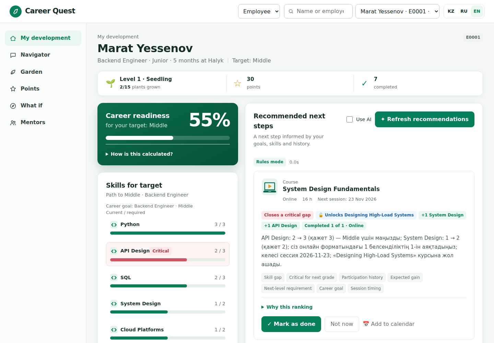
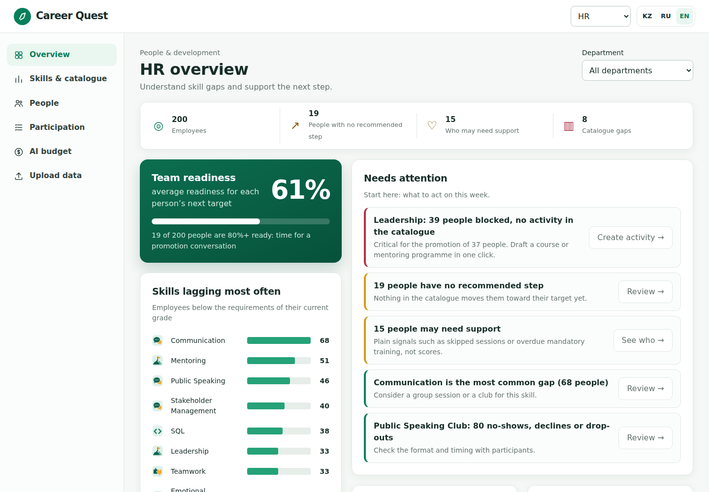
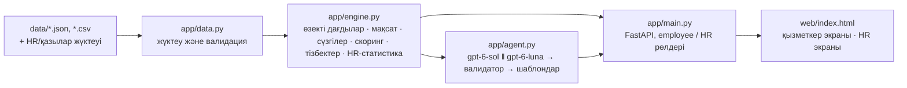

# Career Quest — қызметкер дамуының AI-навигаторы

[Русский](README.md) · [English](README.en.md) · **Қазақша**

HackAlem AI 2026 · **Track 03 · Management · Career Quest кейсі (Halyk Bank)** — «қызметкердің өмірлік циклін геймификациялау платформасы». Nyanachi командасы.

## Қысқаша сипаттама

Қызметкер мансаптық оқиғалар туралы бытыраңқы хабарламалар алады және әр белсенділіктің неге апаратынын көрмейді, сондықтан оқу формалды түрде өтеді. **Career Quest** қызметкерге келесі грейдке апаратын жолды көрсетеді және бірнеше факторға бірден сүйене отырып, «неліктен дәл осы» деген түсіндірмемен 1–3 келесі қадамды ұсынады: келесі грейд талаптарына қатысты дағдылардағы олқылықтар, дағдының қызметте жоғарылау үшін сыни маңыздылығы, қатысу тарихы (келмей қалу, бас тарту, форматтар бойынша тасталған белсенділіктер) және дағдының күтілетін өсімі. HR қай дағдылардың жиі артта қалатынын, кімде қолжетімді келесі қадам жоқ екенін және белсенділіктердің қалай өтіп жатқанын көреді.

Пайдаланушылар: еңбек өтілі 1–5 жыл қызметкер (негізгі) және HR / басшы.

## Жылдам бастау

```bash
git clone https://github.com/BAITC-Hacks/hack-34398b15-nyanachi.git
cd hack-34398b15-nyanachi
./run.sh                 # Python 3.12+; http://127.0.0.1:8000 ашыңыз
```

- API кілтісіз бәрі ережелер режимінде жұмыс істейді; AI-негіздемелер үшін — `cp .env.example .env` орындап, `OPENAI_API_KEY` көрсетіңіз.
- Қызметкер экраны: `E0001` таңдаңыз → «Recommend next steps» → «Mark as done».
- HR экраны: «View» ауыстырғышы → «HR», **құпиясөз `hr-demo`** (`HR_PASSWORD` айнымалысы).
- Тексеру: `.venv/bin/python -m pytest -q` (26 тест) және `.venv/bin/python -m eval.run_benchmark` (9/9).

## Скриншоттар





## Не іске асырылды

Кейстің міндетті талаптары:

| Талап | Қайдан көруге болады |
|---|---|
| Профиль және траектория: рөл, грейд, дағдылар, өткен белсенділіктер, қолжетімді қадамдар | Қызметкер экраны: «Career readiness» карточкасы (мақсатқа дайындық пайызы), «Skills for target» — «ағымдағы / талап етілетін» шкалалары, сыни дағдылар ерекшеленген |
| 1–3 келесі қадамның AI-ұсынымы | «Recommend next steps» батырмасы (`POST /api/employees/{id}/recommend`) |
| Кемінде 3 фактор бойынша түсіндірме | Негіздеме мәтіні + фактор тегтері + сандары бар чиптер (олқылық, сыни маңыздылық, өсім, «осы форматта Y ішінен X аяқталды») |
| Прогресті жаңарту | «Mark as done» → `max_level` ескерілген дағды өсімі, грейдке дайындық пен ұсынымдарды қайта есептеу |
| Қарапайым HR экраны | Артта қалған дағдылар, ұсынылатын қадамы жоқ қызметкерлер (себебімен), белсенділіктер бойынша қатысу |
| Датасет форматындағы қосымша профильдер мен тарихты жүктеу (кейс мысалындағыдай минималды профиль — `employee_id, role, grade, tenure_months, skills` — та қабылданады) | HR экраны → `employees.json` / `activity_history.csv` жүктеу (`POST /api/data/upload`) |
| Профильдегі қолжетімді келесі қадамдар | Форматы, ең жақын сессиясы және дағды өсімі көрсетілген «Available next steps» тізімі |

Міндетті талаптардан тыс:
- **AI-навигатор (агентпен чат)** — қызметкер «неге бұл қадам бірінші?», «кім менің менторым бола алады?», «Lead үшін не қажет?» деп сұрайды. Агент (`gpt-6-sol`, function calling) механизм құралдарын өзі шақырады — профиль шолуы, ұсынымдар, дағды бойынша нұсқалар, белсенділік түсіндірмесі, жолды модельдеу, менторлар — және тек солардың нәтижелері бойынша жауап береді. Құралдар жүйеге кірген бір қызметкердің деректерімен шектелген; интерфейсте қандай құралдар қолданылғаны көрінеді.
- **Дайындық қалай есептеледі** — ашылмалы есептеу: есепке алынған деңгейлер / талап етілетін деңгейлер және дағдылар бойынша жетіспейтін деңгейлер тізімі.
- **Себебі көрсетілген «Қазір емес»** — «ыңғайсыз формат», «уақыт жоқ», «қызық емес». Белсенділік жасырылады; «формат» себебі келесі ұсынымдарда осы форматтың салмағын азайтады. Айыппұлсыз — қатысу ерікті.
- **«Неге айқын таңдау емес»** — неге ең әлсіз дағды таңдалмағаны туралы түсіндірме (мысалы, «сіз ұқсас белсенділіктерді үш рет өткізіп алдыңыз, ал дағды Senior үшін сыни емес»).
- **Пререквизит тізбектері** — егер құнды белсенділік пререквизитпен жабық болса, жүйе оны ашатын қадамды ұсынады («Designing High-Load Systems қолжетімділігін ашады»).
- **Жабатын ештеңе жоқ олқылықтар** — каталогта қолжетімді белсенділігі жоқ сыни дағдылар; қызметкерге менторлықты талқылау ұсынылады, HR каталогтағы кемшілікті көреді.
- **Тұзақ профильдердегі бенчмарк** — «ең төмен дағды» ережесі қателесетін 9 профиль: базалық ереже 0/9, Career Quest 9/9.
- Негіздемелер қызметкердің тілінде (`preferred_language` бойынша kk / ru / en), интерфейс KZ / RU / EN тілдерінде.

Кейстің қосымша тармақтары:
- **Грейдке өтуді модельдеу** — «Не болар еді, егер»: жүйе ең жақсы қадамды алады, дағды өсімін қолданады және ең жақын сессиялардың күндерін ретімен көрсетіп, қайта жоспарлайды (5 қадамға дейін). Мысал: E0001 — дайындық желтоқсанға қарай 54.5% → 75.8%. Ештеңе сақталмайды.
- **Кеңейтілген HR-дашборд** — бөлімше бойынша сүзгі және «каталог кемшіліктері»: қызметкерлерге мақсат үшін қажет, бірақ ешбір қолжетімді белсенділік көтере алмайтын дағдылар (мысалы, Leadership 38 қызметкердің қызметте жоғарылауы үшін сыни, ал курс жоқ).
- **Менторлық** — ең үлкен олқылықтар үшін сол бөлімшедегі Senior/Lead деңгейіндегі, осы дағдыда мықты және менторлық етуге дайын әріптестер іріктеледі (Mentoring ≥ 3 немесе Mentor Track өтілген). Тек аты мен рөлі көрсетіледі, әріптестердің дағды деңгейлері ашылмайды.
- **Ішкі валюта және марапаттар** — ұпайлар тек ерікті белсенділіктер үшін беріледі (белсенділік үшін +10, дағдының әр көтерілген деңгейі үшін +10), міндетті оқулар ұпай бермейді; марапаттар каталогы және ұпайларды айырбастау. Балансты тек қызметкердің өзі көреді.
- **Жеке челлендждер** — модельденген жолдан алынған ерікті мақсат («23 қарашаға дейін API Design 3 деңгейіне жету»), орындалғанда +50 ұпай.
- **HR-ға арналған белсенділік конструкторы** — «каталог кемшіліктері» кестесінде «Белсенділік құру» батырмасы: жүйе бұғатталған қызметкерлердің рөлдері мен грейдтеріне сай жобаны толтырады (мысалы, Leadership — 40 адам), HR түзетіп, жариялайды, белсенділік бірден ұсынымдарға түседі, кемшілік жабылады.
- **Кімге қолдау қажет («жұмыстан кету қаупінің» орнына)** — HR жасырын баллсыз түсінікті сигналдарды көреді: бір жылдағы өткізіп алулар, мерзімі өткен міндетті оқулар, 6 ай бойы аяқталған белсенділіктің болмауы, мансаптық мақсаттың жоқтығы, ұзақ уақыт Junior болу — және ұсынылған әрекет (формат туралы сұрау, жүктемені тексеру, ментор ұсыну, мақсаттар туралы сөйлесу). Тек HR үшін.
- **Әріптестерді мойындау** — өз бөлімшесіндегі менторға «Алғыс айту»: алушы алғысты және +15 ұпайды көреді; күніне 3 алғыстан артық емес және бір әріптеске аптасына біреуден артық емес; ештеңе жарияланбайды.
- **Команда мақсаты** — бөлімшенің жалпы прогресі (90 күнде аяқталған ерікті белсенділіктер адам басына бір белсенділік нысанасымен салыстырғанда), анонимді және адамдарды салыстырусыз.
- **Жылдамдық** — ұсынымдар алдымен ережелер режимінде лезде шығады, содан кейін AI-нұсқасымен ауыстырылады; AI-жауап профиль күйі бойынша кэштеледі және профиль ашылғанда алдын ала жүктеледі.
- **Дағдылар бағы және деңгей** — мақсаттың әр дағдысы өсімдікпен көрсетілген, өсу сатысы = дағдының нақты деңгейі (0–5); жеке деңгей (Seedling → Forest keeper) ұпайлармен бірге өседі. Бақты өз бөлімшесіндегі әріптестерге тек өзара келісім бойынша көрсетуге болады; рейтингтер жоқ. Өсімдік суреттері хакатон барысында `gpt-image-2.5` арқылы генерацияланған.
- Шаблондық негіздемелермен **API кілтісіз** жұмыс (ережелер режимі).

## Шешім қалай жұмыс істейді


1. Бастапқы датасетті (`data/`) және қажет болса, қосымша профильдер мен тарихты **жүктеу**; схема Pydantic модельдерімен тексеріледі.
2. **Өзекті дағдылар.** Дағды деңгейлері соңғы аттестацияны көрсетеді, сондықтан оларға `last_review_date` күнінен кейін аяқталған белсенділіктерден алынған өсім қосылады (`max_level` шектеуімен).
3. **Мақсат.** `career_goal`, егер ол берілсе (соның ішінде басқа рөлде), әйтпесе ағымдағы рөлдің келесі грейді; мақсаты жоқ Lead үшін — ағымдағы грейдтің сыни дағдылары.
4. **Қолжетімділік сүзгілері.** Мыналар алынып тасталады: міндетті белсенділіктер, бұрын өтілген белсенділіктер (қайталанатын `EV_036` қоспағанда), орындалу үстіндегі белсенділіктер, рөлі/грейді сәйкес келмейтіндер, пререквизиттері орындалмағандар, болашақ сессиялары жоқтар және дағды өсімі қалмағандар.
5. Әр қолжетімді белсенділікті ашық формула бойынша (төменде) **скорингтеу** + пререквизит арқылы құнды белсенділікті ашқаны үшін бонус.
6. **AI қабаты.** `gpt-6-sol` есептелген факторлары бар ең үздік 6 кандидатты алады және 1–3 қадамды таңдап, негіздемені қызметкердің тілінде тұжырымдайды (Structured Outputs, қатаң JSON схемасы). Валидатор тексереді: 1–3 қадам, тек кандидаттар тізіміндегі ID, әр қадамға ≥3 фактор. `gpt-6-luna` резервтік нұсқа ретінде қатар іске қосылады; егер 8.5 с ішінде ешбір модель дұрыс жауап бермесе — шаблондық негіздемелер қолданылады. Әдеттегі жауап уақыты 5–7 с (кейс талабы ≤10 с).
7. **Прогресс.** «Mark as done» тарихқа жазба қосады, дағдылар мен дайындық қайта есептеледі.

### Ұсынымдардың сенімділігі

- Тек пайдалы қадамдар ұсынылады — мақсатқа дейінгі олқылықты жабатын немесе сондай белсенділікті ашатын қадамдар; «1–3» үшке дейін дегенді білдіреді, орындар пайдасыз қадамдармен толтырылмайды. Пайдалы қадамдар болмаса, қызметкер «менторлық туралы сөйлесіңіз» деген ұсынысты көреді, ал HR осы қызметкерді себебімен көреді.
- Қызметкер екі рет бас тартқан белсенділік енді ұсынылмайды; қайталанатын клуб (`EV_036`) күніне бір реттен жиі есепке алынбайды.
- Аяқталған белсенділіктерден алынған өсім бір рет есептеледі: «орындалды» белгісі аттестация күнін қайта жазбайды, сондықтан өсім екі еселенбейді.
- AI белсенділік үшін шынымен дұрыс факторларды ғана мәлімдей алады (мысалы, «грейд үшін сыни» — қадам сыни олқылықты жапқан жағдайда ғана). Расталмаған факторлар алынып тасталады; егер үштен аз қалса — шаблондық негіздеме қолданылады.
- Рөлді ауыстыру үшін (мақсат басқа рөлде) мақсатты рөлдің мақсатты грейдті қоса алғанда базалық белсенділіктері жарайды.
- AI механизмнің таңдауын нашарлата алмайды: жауапта score ең жоғары қадам міндетті түрде болуы керек, балама болған кезде қызметкер аулақ жүретін форматты таңдауға болмайды, және кемінде бір фактор олқылықтан туындамауы тиіс (тарих, формат, мерзімдер, мақсат, сыни маңыздылық). Әйтпесе — шаблондық негіздеме.
- «Орындалды деп белгілеу» тек рұқсат етілген белсенділіктерді қабылдайды: өтілгенін қайталау, міндетті белсенділік, өз рөліне/грейдіне жатпайтын белсенділік немесе пререквизиттері орындалмаған белсенділік — 422.
- «Орындалу үстіндегі» белсенділіктер қайта ұсынылмайды, «бастағаныңызды аяқтаңыз» ретінде көрсетіледі.
- Әр карточкада «Why this ranking» ашылады — формуланың әр бөлігінің қорытынды score-ға қосқан үлесі.
- 26 тест; олардың бірі барлық 200 қызметкерді және тұзақ профильдерді тексереді: қадамдар рұқсат етілген, міндетті емес, қайталанбайды, детерминирленген және ≥3 расталған факторы бар.

### Скоринг формуласы

```
пайдалы_өсім(дағды) = min(жаңа_деңгей, талап_етілетін) − ағымдағы        # жаңа_деңгей = min(ағымдағы + gain, max_level)
олқылық_салмағы = Σ пайдалы_өсім × (2, егер дағды мақсат үшін сыни болса, әйтпесе 1)
сенімділік   = 0.7 × аяқтау_үлесі(формат) + 0.3 × аяқтау_үлесі(түр)   # үлес = (аяқталған+1)/(аяқталған+өткізілген+2)
score = (олқылық_салмағы + 0.2 × талаптан_тыс_өсім) × (0.2 + 0.8 × сенімділік)
        × 0.6, егер қызметкер форматтан аулақ жүрсе (≥3 өткізу және 0 аяқтау)
        × 0.9 / 1.05, егер қызметкердің осы түрдегі белсенділіктерге берген орташа бағасы ≤2.5 / ≥4.5
        − 0.25 × max(0, ұқсастарды_өткізу − 1) − 0.01 × сағаттар − 0.15, егер ең жақын сессия 90 күннен кейін болса
        + 0.5 × бұғатталған_белсенділік_score, егер қадам оның пререквизитін ашса
мақсатқа дайындық, % = Σ min(деңгей, талап_етілетін) / Σ талап_етілетін
```

## Технологиялар

- Python 3.12, FastAPI, Pydantic, Uvicorn
- OpenAI API: `gpt-6-sol` (негізгі модель), `gpt-6-luna` (жылдам резервтік нұсқа), Structured Outputs бар Responses API
- Интерфейс: құрастырусыз және сыртқы CDN-сіз бір HTML/CSS/JS файлы (ішкі контурда жұмыс істейді)
- pytest

## AI құны (бағалау)

Токендер нақты шақыруларда өлшенді: бір AI-ұсыным ≈ 2 050 кіріс және ≈ 300 шығыс токен (`gpt-6-sol` + қатар жұмыс істейтін резервтік `gpt-6-luna`), навигаторға бір сұрақ ≈ 2 050 / 170 токен (құралдар циклінде модельді 2–3 рет шақыру). Бағалар: `gpt-6-sol` $2 / $10, `gpt-6-luna` $0.10 / $0.50, 1 млн токен үшін.

| | Бір қызметкерге айына | 40 қызметкер | 1 000 | 15 000 |
|---|---|---|---|---|
| Әдеттегі пайдалану: 8 жаңа AI-ұсыным + навигаторға 10 сұрақ | ≈ $0.12 | ≈ $5 | ≈ $117 | ≈ $1 760 |
| Белсенді пайдалану (×3) | ≈ $0.35 | ≈ $14 | ≈ $350 | ≈ $5 270 |
| Тек `gpt-6-luna` (`OPENAI_MODEL=gpt-6-luna`) | ≈ $0.006 | < $1 | ≈ $6 | ≈ $87 |
| Ережелер режимі (кілтсіз) | $0 | $0 | $0 | $0 |

- HR экранындағы «AI budget» блогы бұл сомаларды кез келген қызметкер саны үшін қайта есептейді және осы серверде нақты жұмсалған токендерді көрсетеді.
- Қайта қарау ақы тұрмайды: AI-жауап профиль күйі бойынша кэштеледі, жаңа шақыру тек «орындалды», «қазір емес» немесе жаңа белсенділіктен кейін жасалады.
- Жабық контур үшін: `OPENAI_BASE_URL` банк ішіндегі vLLM-дегі Qwen-ге бағытталады — токендер үшін төлемнің орнына GPU-дың тіркелген құны, деректер банктен шықпайды.

## Архитектура



```
app/config.py   орта айнымалыларынан алынатын баптаулар
app/data.py     деректер модельдері, датасетті жүктеу және біріктіру
app/engine.py   детерминирленген ядро: AI сүйенетін барлық сандар; грейдке жол, менторлар, ұпайлар, бақ
app/agent.py    AI таңдауы мен негіздемесі, валидация, резервтік нұсқалар
app/chat.py     AI-навигатор: механизм үстінде жұмыс істейтін құралдары бар агент
app/main.py     REST API және employee / HR құқықтарын бөлу
web/index.html  интерфейс; web/garden/ — өсімдіктердің өсу сатыларының суреттері
eval/           датасет форматындағы тұзақ профильдер және бенчмарк
tests/          ядро тесттері
data/           ұйымдастырушылардың бастапқы датасеті
```

Құқықтар: `POST /api/login` HMAC (`APP_SECRET`) арқылы қол қойылған токен береді. Қызметкер өз ID-і бойынша кіреді (жұмыс жүйесінде — банктің SSO арқылы), HR — `HR_PASSWORD` құпиясөзімен (әдепкі бойынша `hr-demo`). Әр жеке эндпоинт `Authorization: Bearer <токен>` немесе `X-Auth-Token: <токен>` тақырыбында токенді талап етеді (прокси basic-auth-пен қайшылық болмауы үшін интерфейс екіншісін пайдаланады): токенсіз немесе жалған токенмен — 401, бөтен профильге немесе HR деректеріне жүгінген қызметкерге — 403. Тек каталог (дағдылар, белсенділіктер, .ics) және метадеректер ашық. Жария рейтингтер жоқ.

## Орнату және іске қосу

Талаптар: Python 3.12+, Linux/macOS (немесе WSL), пакеттерді орнату үшін интернетке қолжетімділік.

```bash
git clone https://github.com/BAITC-Hacks/hack-34398b15-nyanachi.git
cd hack-34398b15-nyanachi
./run.sh                 # .venv жасайды, тәуелділіктерді орнатады, http://127.0.0.1:8000 іске қосады
```

Интерфейс: http://127.0.0.1:8000 · API құжаттамасы: http://127.0.0.1:8000/docs

HR экраны **`hr-demo`** құпиясөзімен ашылады (`HR_PASSWORD` айнымалысы арқылы өзгертіледі).

API кілтісіз қосымша ережелер режимінде жұмыс істейді. AI-негіздемелерді қосу үшін:

```bash
cp .env.example .env     # және OPENAI_API_KEY көрсетіңіз
./run.sh
```

Порт пен мекенжайды өзгертуге болады: `PORT=8080 HOST=0.0.0.0 ./run.sh`.

### Орта айнымалылары

| Айнымалы | Әдепкі мәні | Мақсаты |
|---|---|---|
| `OPENAI_API_KEY` | бос | OpenAI кілті. Бос болса — AI-сыз ережелер режимі |
| `OPENAI_MODEL` | `gpt-6-sol` | Негізгі модель |
| `OPENAI_FAST_MODEL` | `gpt-6-luna` | Резервтік жылдам модель |
| `AI_TIMEOUT_S` | `8.5` | AI-жауапқа бөлінген уақыт бюджеті |
| `DATA_DIR` | `./data` | Датасет орналасқан қалта |
| `HR_PASSWORD` | `hr-demo` | HR экранының құпиясөзі |
| `APP_SECRET` | іске қосқанда кездейсоқ | Токендерге қол қою кілті (токендер қайта іске қосудан кейін де жарамды болуы үшін орнатыңыз) |
| `OPENAI_BASE_URL` | бос | Кез келген OpenAI-үйлесімді сервер: OpenRouter немесе банк контурындағы vLLM. Бос болса — api.openai.com |
| `AI_REASONING` | `none` | Модельдің пайымдау деңгейі (жауап жылдамдығы) |
| `CHAT_TIMEOUT_S` | `20` | Навигатор жауабына бөлінген уақыт бюджеті |

### Тәуелділіктер

`requirements.txt`: fastapi, uvicorn, python-multipart, pydantic, openai, python-dotenv, pytest (нұсқалары бекітілген).

## Шешімді қалай тексеруге болады

**1. Тесттер және бенчмарк (кілтсіз):**

```bash
.venv/bin/python -m pytest -q                 # 26 тест
.venv/bin/python -m eval.run_benchmark        # ережелер режимі: Baseline 0/9 · Career Quest 9/9
.venv/bin/python -m eval.run_benchmark --ai   # AI-мен (кілт қажет): бұл да 9/9
```

**2. Интерфейстегі қызметкер сценарийі** (төмендегі сандар жаңа ғана іске қосылған серверге қатысты: «орындалды» белгілері мен жүктемелер қайта іске қосылғанға дейін жадта сақталады):
1. http://127.0.0.1:8000 ашып, «Employee» режимін таңдаңыз, `E0001` қызметкерін таңдаңыз (Backend Engineer, Junior → Middle, дайындық 54.5%).
2. «Recommend next steps» басыңыз. Ережелер режимінде `System Design Fundamentals` («Closes a critical gap» және «Unlocks Designing High-Load Systems» чиптерімен), `Cloud Certification Prep`, `Public Speaking Club` күтіледі. Кілтпен — таңдау мен тұжырымдар `gpt-6-sol` моделінен.
3. Бірінші қадамдағы «Mark as done» басыңыз — «Career readiness» карточкасындағы System Design және API Design шкалалары мен дайындық пайызы өседі.

**3. Қорғаудағыдай профильдерді жүктеу:** «HR» режимі (құпиясөз `hr-demo`) → `eval/trap_employees.json` және `eval/trap_history.csv` жүктеңіз → `E9103` қызметкерін таңдаңыз (офлайн сабақтарды өткізіп алады). Бірінші қадам ретінде сол тақырыптағы офлайн-воркшоп емес, `Architecture Review Circle` онлайн-белсенділігі күтіледі. Жылдамырақ: HR → «Upload data» → «Load example data» дәл осы файлдарды бір батырмамен жүктейді және қосылған профильдерді ашатын батырмаларды көрсетеді; мысал файлдарды сол жерден жүктеп алуға да болады (`GET /api/data/examples/employees.json`, `.../activity_history.csv`).

Жүктеу форматтары — қазылар алқасының файлдары сол күйінде қабылдануы үшін: профильдер — бастапқы жинақ файлы `{"employees": [...]}`, профильдер тізімі немесе кейс мысалындағыдай бір профиль нысаны; дағдылар — ID (`SK_SYSTEM_DESIGN`) немесе атауы (`System Design`) бойынша. Тарих — `,` немесе `;` бөлгіші бар CSV, Excel BOM-ымен немесе онсыз; тек `employee_id, event_id, date, status` міндетті. Бар ID-мен өзгертілген профиль жүктелсе (мысалы, кейс мысалындағы `E0028`), оның бастапқы датасеттегі тарихы енді есепке алынбайды — профиль жүктелген тарих бойынша бағаланады (файлдарды жүктеу реті маңызды емес). Қателер (белгісіз рөл, дағды немесе белсенділік) түсінікті 422 хабарламасымен қайтарылады.

Кейс мысалындағыдай минималды профиль де қабылданады (қалған өрістер әдепкі мәндермен толтырылады) — JSON-тізім немесе `{"employees": [...]}`:

```json
[{"employee_id": "E9999", "role": "Backend Engineer", "grade": "Junior",
  "tenure_months": 14, "skills": {"SK_PYTHON": 2, "SK_SQL": 1}}]
```

**4. Қосымша функциялар (кілтсіз):** `E0001` қызметкер экранында сол жақ мәзір тармақтары мен беттің төменгі жағындағы қойындылар — «What if» (грейдке жол: желтоқсанға қарай 54.5% → 75.8%), «Mentors», «Points» (челленджді қабылдау, ұпайларды айырбастау), «Garden» («Mark as done» басқаннан кейін өсімдіктер өседі). HR экранында (құпиясөз `hr-demo`) — бөлімше сүзгісі, «Create activity» батырмасы бар «Catalogue gaps» және «Who may need support» блогы. Ментор жанында — «Say thanks».

**5. Навигатор (`OPENAI_API_KEY` қажет):** «Navigator» қойындысы («Ask your navigator») → «Why is this my first step?». Жауапта — нақты белсенділіктерге сілтемелер және шақырылған құралдар көрсетілген «Checked: …» жолы. Кілтсіз эндпоинт түсінікті хабарламамен 503 қайтарады, қосымшаның қалған бөлігі жұмыс істейді.

**6. API арқылы** (алдымен токендерді алыңыз):

```bash
login() { curl -s -X POST http://127.0.0.1:8000/api/login -H "Content-Type: application/json" -d "$1" \
          | python3 -c "import json,sys; print(json.load(sys.stdin)['token'])"; }
EMP=$(login '{"role":"employee","employee_id":"E0001"}')
HR=$(login '{"role":"hr","password":"hr-demo"}')

curl -X POST "http://127.0.0.1:8000/api/employees/E0001/recommend?ai=false" -H "Authorization: Bearer $EMP"
curl -X POST http://127.0.0.1:8000/api/employees/E0001/complete -H "Authorization: Bearer $EMP" \
     -H "Content-Type: application/json" -d '{"event_id":"EV_005"}'
curl http://127.0.0.1:8000/api/employees/E0001/path    -H "Authorization: Bearer $EMP"
curl http://127.0.0.1:8000/api/employees/E0001/mentors -H "Authorization: Bearer $EMP"
curl http://127.0.0.1:8000/api/employees/E0001/wallet  -H "Authorization: Bearer $EMP"
curl http://127.0.0.1:8000/api/employees/E0001/garden  -H "Authorization: Bearer $EMP"
curl -X POST http://127.0.0.1:8000/api/employees/E0001/chat -H "Authorization: Bearer $EMP" \
     -H "Content-Type: application/json" -d '{"message":"Why is this my first step?"}'
curl http://127.0.0.1:8000/api/hr/summary -H "Authorization: Bearer $HR"
curl "http://127.0.0.1:8000/api/hr/summary?department=Sales" -H "Authorization: Bearer $HR"
curl -X POST http://127.0.0.1:8000/api/data/upload -H "Authorization: Bearer $HR" \
     -F employees=@eval/trap_employees.json -F history=@eval/trap_history.csv
curl -o /dev/null -w "%{http_code}\n" http://127.0.0.1:8000/api/hr/summary   # токенсіз 401
```

## Тұзақ профильдердегі бенчмарк

| Тұзақ | «Ең төмен дағды» ережесі | Career Quest |
|---|---|---|
| Ең әлсіз дағды (Public Speaking) үш рет өткізілген, System Design сыни | ❌ Public Speaking Club | ✅ System Design бойынша қадам |
| Cloud деңгейі ескірген: сертификаттау аттестациядан кейін өтілген | ❌ Cloud Certification Prep | ✅ қадамды жабылып қойған дағдыға жұмсамайды |
| System Design бойынша сыни олқылық, қызметкер офлайн сабақтарға бармайды | ❌ | ✅ онлайн Architecture Review Circle |
| Мақсат — Senior Backend емес, Data Analyst | ❌ | ✅ аналитик дағдылары |
| Құнды белсенділіктер пререквизитпен жабық | ❌ | ✅ ашатын қадам ретінде System Design Fundamentals |
| Курс `max_level` шегіне тіреледі, деңгей қазірдің өзінде максималды | ❌ | ✅ өсім бермейтін курс ұсынылмайды |
| Ескірген дағды **және** офлайннан аулақ жүру бір мезгілде | ❌ | ✅ Cloud емес, System Design бойынша онлайн-қадам |
| Data Analyst Senior мақсаты бар Lead (рөлді ауыстыру) | ❌ | ✅ Applied Statistics — сыни дағдының негізі |
| Қатысу тарихы мүлдем жоқ | ❌ | ✅ сыни олқылық бойынша қадам |
| **Барлығы** | **0/9** | **9/9** (ережелер режимінде де, AI-мен де) |

## Деректер және интеграциялар

- `data/` — ұйымдастырушылардың синтетикалық бастапқы датасеті (200 қызметкер, 40 белсенділік, 60 дағды, тарихтың 2 743 жазбасы, кесінді күні 2026-10-01). Тек шешімді тексеру үшін енгізілген, таратуға арналмаған.
- `eval/` — сол схемадағы біздің синтетикалық тұзақ профильдеріміз.
- Сыртқы сервис: OpenAI API (тек ұсынымдарды тұжырымдау үшін; модель аты-жөні көрсетілмеген бір қызметкердің профилін және алдын ала есептелген факторларды алады). Кілтсіз пайдаланылмайды.
- Нақты дербес деректер пайдаланылмайды.

## Deployed-нұсқа (демо)

AI кілті бапталған демо: https://kitan-a.com/careerquest/ — кейс деректері болғандықтан құпиясөзбен жабық; логин мен құпиясөз қазыларға платформадағы шешімді тапсыру формасында берілген. Біздің есептік жазбаларымызсыз өз бетінше тексеру үшін `./run.sh` (ережелер режимі) немесе өз `OPENAI_API_KEY` кілтіңіз жеткілікті.

## Шектеулер

- Демо деңгейіндегі кіру: қызметкер өз ID-ін таңдайды, HR құпиясөз енгізеді; токендерге HMAC арқылы қол қойылған. Банктің SSO жүйесіне (Azure AD / Keycloak) қосылу — `/api/login` эндпоинтін ауыстыру ғана, құқықтарды тексерудің қалған бөлігі өзгермейді.
- Деректер процесс жадында сақталады: жүктемелер мен «орындалды» белгілері қайта іске қосқанда жойылады.
- «Орындалды» белгісін қызметкердің өзі қояды (кейс сценарийі талап ететіндей); жұмыс жүйесінде ұпай есептелмес бұрын аяқтау фактісі LMS-тен келуі немесе басшымен расталуы тиіс.
- Ұпайлар, челлендждер, айырбастар және «бақпен бөлісу» баптаулары процесс жадында сақталады және қайта іске қосқанда жойылады.
- Марапаттар каталогы мен деңгей шектері кодта мысал ретінде берілген; нақты жүйеде оларды HR баптайды.
- Скоринг формуласының салмақтары датасет пен тұзақ профильдерде қолмен іріктелген, нақты нәтижелерге оқытусыз.
- HRIS және мессенджерлермен интеграциялар жоқ; күнтізбе — тек `.ics` экспорты («Add to calendar» батырмасы), синхрондаусыз.

## Пайдаланылған компоненттер және AI құралдары

- `requirements.txt` ішіндегі ашық кітапханалар (MIT/BSD/Apache-2.0 лицензиялары).
- 13:00-ге дейін репозиторийге тек қолжетімділікті тексеру (`.gitignore`, `.env.example`), шағын дайындама-шаблон (Streamlit + OpenAI шақыру мысалы, ~200 жол) және API шақыру мысалдары жіберілді. Олардың кейске қатысы жоқ және 13:00-ден кейін жойылды; Career Quest-тің бүкіл логикасы (механизм, AI қабаты, API, интерфейс, тесттер) жарыс бөлімі барысында жазылған — бұл коммиттер тарихынан көрінеді.
- AI агенттерінің көмегімен әзірлеу: Claude Code (Anthropic) және Codex (OpenAI); Codex сондай-ақ интерфейстің жобасын жасау және бетті тестілеу үшін пайдаланылды. Иллюстрациялар (белгішелер, бақ өсімдіктері, пайплайн сызбасы) хакатон барысында `gpt-image-2.5` арқылы генерацияланған.
