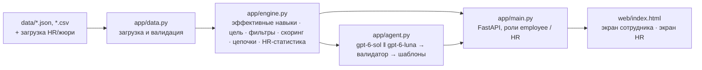

# Career Quest — AI-навигатор развития сотрудника

Кейс Halyk Bank «Career Quest — платформа геймификации жизненного цикла сотрудника» (HackAlem AI 2026, трек Management).

## Краткое описание

Сотрудник получает карьерные события разрозненными уведомлениями и не видит, куда ведёт каждая активность, поэтому обучение проходится формально. **Career Quest** показывает сотруднику путь к следующему грейду и предлагает 1–3 следующих шага с объяснением «почему именно это», опираясь на несколько факторов сразу: разрывы в навыках относительно требований следующего грейда, критичность навыка для повышения, историю участия (неявки, отказы, брошенные активности по форматам) и ожидаемый прирост навыка. HR видит, какие навыки отстают чаще всего, у кого нет доступного следующего шага и как проходят активности.

Пользователи: сотрудник со стажем 1–5 лет (основной) и HR / руководитель.

## Что реализовано

Обязательные требования кейса:

| Требование | Где смотреть |
|---|---|
| Профиль и траектория: роль, грейд, навыки, пройденные активности, доступные шаги | Экран сотрудника: «Path to …», шкалы навыков «текущий / требуемый», критичные навыки подсвечены |
| AI-рекомендация 1–3 следующих шагов | Кнопка «Recommend next steps» (`POST /api/employees/{id}/recommend`) |
| Объяснение минимум по 3 факторам | Текст обоснования + теги факторов + чипы с числами (разрыв, критичность, прирост, «завершено X из Y в этом формате») |
| Обновление прогресса | «Mark as done» → прирост навыка с учётом `max_level`, пересчёт готовности к грейду и рекомендаций |
| Простой HR-экран | Отстающие навыки, сотрудники без рекомендуемого шага (с причиной), участие по активностям |
| Загрузка дополнительных профилей и истории в формате датасета | HR-экран → загрузка `employees.json` / `activity_history.csv` (`POST /api/data/upload`) |

Сверх обязательного:
- **«Почему не очевидный выбор»** — объяснение, почему не выбран самый слабый навык (например, «вы трижды пропустили похожие активности, и навык не критичен для Senior»).
- **Цепочки пререквизитов** — если ценная активность закрыта пререквизитом, система рекомендует шаг, который её открывает («открывает доступ к Designing High-Load Systems»).
- **Разрывы, которые нечем закрыть** — критичные навыки, для которых в каталоге нет доступной активности; сотруднику предлагается обсудить менторство, HR видит пробел в каталоге.
- **Бенчмарк на ловушках** — 6 профилей, на которых правило «самый низкий навык» ошибается: базовое правило 0/6, Career Quest 6/6.
- Обоснования на языке сотрудника (kk / ru / en по `preferred_language`), интерфейс на KZ / RU / EN.
- Работа **без API-ключа** (режим правил) с шаблонными обоснованиями.

## Как работает решение

1. **Загрузка** стартового датасета (`data/`) и, при необходимости, дополнительных профилей и истории; схема проверяется Pydantic-моделями.
2. **Эффективные навыки.** Уровни навыков отражают последнюю аттестацию, поэтому к ним добавляется прирост от активностей, завершённых после `last_review_date` (с ограничением `max_level`).
3. **Цель.** `career_goal`, если задана (в том числе в другой роли), иначе следующий грейд текущей роли; у Lead без цели — критичные навыки текущего грейда.
4. **Фильтры доступности.** Исключаются обязательные активности, уже пройденные (кроме повторяемой `EV_036`), активности в процессе, не подходящие по роли/грейду, с невыполненными пререквизитами, без будущих сессий и без оставшегося прироста навыка.
5. **Скоринг** каждой доступной активности по прозрачной формуле (ниже) + бонус за открытие ценной активности через пререквизит.
6. **AI-слой.** `gpt-6-sol` получает 6 лучших кандидатов с посчитанными факторами и выбирает 1–3 шага, формулируя обоснование на языке сотрудника (Structured Outputs, строгая JSON-схема). Валидатор проверяет: 1–3 шага, только ID из списка кандидатов, ≥3 фактора на шаг. `gpt-6-luna` запускается параллельно как запасной вариант; если ни одна модель не ответила корректно за 8.5 с — используются шаблонные обоснования. Типичное время ответа 5–7 с (требование кейса ≤10 с).
7. **Прогресс.** «Mark as done» добавляет запись в историю, навыки и готовность пересчитываются.

### Формула скоринга

```
полезный_прирост(навык) = min(новый_уровень, требуемый) − текущий        # новый_уровень = min(текущий + gain, max_level)
очки_разрыва = Σ полезный_прирост × (2, если навык критичен для цели, иначе 1)
надёжность   = 0.7 × доля_завершений(формат) + 0.3 × доля_завершений(тип)   # доля = (завершено+1)/(завершено+пропущено+2)
score = (очки_разрыва + 0.2 × прирост_сверх_требования) × (0.2 + 0.8 × надёжность)
        × 0.6, если формат избегается (≥3 пропуска и 0 завершений)
        − 0.25 × max(0, пропуски_похожих − 1) − 0.01 × часы
        + 0.5 × score_заблокированной_активности, если шаг открывает её пререквизит
готовность к цели, % = Σ min(уровень, требуемый) / Σ требуемый
```

## Технологии

- Python 3.12, FastAPI, Pydantic, Uvicorn
- OpenAI API: `gpt-6-sol` (основная модель), `gpt-6-luna` (быстрый запасной вариант), Responses API со Structured Outputs
- Интерфейс: один файл HTML/CSS/JS без сборки и внешних CDN (работает во внутреннем контуре)
- pytest

## Архитектура



```
app/config.py   настройки из окружения
app/data.py     модели данных, загрузка и слияние датасета
app/engine.py   детерминированное ядро: все числа, на которые опирается AI
app/agent.py    AI-выбор и обоснование, валидация, запасные варианты
app/main.py     REST API и разделение прав employee / HR
web/index.html  интерфейс
eval/           профили-ловушки в формате датасета и бенчмарк
tests/          тесты ядра
data/           стартовый датасет организаторов
```

Права (демо): каждый запрос передаёт заголовок `X-Role: hr` или `X-Role: employee:E0028`. Сотрудник видит только свой профиль (иначе 403); HR-экран и загрузка данных доступны только HR. Публичных рейтингов сотрудников нет.

## Установка и запуск

Требования: Python 3.12+, Linux/macOS (или WSL), доступ в интернет для установки пакетов.

```bash
git clone https://github.com/BAITC-Hacks/hack-34398b15-nyanachi.git
cd hack-34398b15-nyanachi
./run.sh                 # создаёт .venv, ставит зависимости, запускает http://127.0.0.1:8000
```

Интерфейс: http://127.0.0.1:8000 · документация API: http://127.0.0.1:8000/docs

Без API-ключа приложение работает в режиме правил. Чтобы включить AI-обоснования:

```bash
cp .env.example .env     # и указать OPENAI_API_KEY
./run.sh
```

Порт и адрес можно поменять: `PORT=8080 HOST=0.0.0.0 ./run.sh`.

### Переменные окружения

| Переменная | По умолчанию | Назначение |
|---|---|---|
| `OPENAI_API_KEY` | пусто | Ключ OpenAI. Пусто — режим правил без AI |
| `OPENAI_MODEL` | `gpt-6-sol` | Основная модель |
| `OPENAI_FAST_MODEL` | `gpt-6-luna` | Запасная быстрая модель |
| `AI_TIMEOUT_S` | `8.5` | Бюджет времени на AI-ответ |
| `DATA_DIR` | `./data` | Папка с датасетом |

### Зависимости

`requirements.txt`: fastapi, uvicorn, python-multipart, pydantic, openai, python-dotenv, pytest (версии закреплены).

## Как проверить решение

**1. Тесты и бенчмарк (без ключа):**

```bash
.venv/bin/python -m pytest -q                 # 5 тестов ядра
.venv/bin/python -m eval.run_benchmark        # ожидается: Baseline 0/6 · Career Quest 6/6
```

**2. Сценарий сотрудника в интерфейсе:**
1. Открыть http://127.0.0.1:8000, режим «Employee», выбрать `E0001` (Backend Engineer, Junior → Middle, готовность 54.5%).
2. Нажать «Recommend next steps». В режиме правил ожидаются `System Design Fundamentals` (с чипом «Closes a critical gap» и «Unlocks Designing High-Load Systems»), `Cloud Certification Prep`, `Public Speaking Club`. С ключом — выбор и формулировки от `gpt-6-sol`.
3. Нажать «Mark as done» у первого шага — шкалы System Design и API Design и процент готовности растут.

**3. Загрузка профилей, как на защите:** режим «HR» → загрузить `eval/trap_employees.json` и `eval/trap_history.csv` → выбрать сотрудника `E9103` (пропускает офлайн-занятия). Ожидается первым шагом онлайн-активность `Architecture Review Circle`, а не офлайн-воркшоп по той же теме.

**4. Через API:**

```bash
curl -X POST "http://127.0.0.1:8000/api/employees/E0001/recommend?ai=false" -H "X-Role: employee:E0001"
curl -X POST http://127.0.0.1:8000/api/employees/E0001/complete -H "X-Role: employee:E0001" \
     -H "Content-Type: application/json" -d '{"event_id":"EV_005"}'
curl http://127.0.0.1:8000/api/hr/summary -H "X-Role: hr"
curl -X POST http://127.0.0.1:8000/api/data/upload -H "X-Role: hr" \
     -F employees=@eval/trap_employees.json -F history=@eval/trap_history.csv
```

## Бенчмарк на профилях-ловушках

| Ловушка | Правило «самый низкий навык» | Career Quest |
|---|---|---|
| Самый слабый навык (Public Speaking) трижды пропущен, критичен System Design | ❌ Public Speaking Club | ✅ шаг по System Design |
| Уровень Cloud устарел: сертификация пройдена после аттестации | ❌ Cloud Certification Prep | ✅ не тратит шаг на уже закрытый навык |
| Критичный разрыв в System Design, сотрудник не ходит офлайн | ❌ | ✅ онлайн Architecture Review Circle |
| Цель — Data Analyst, а не Senior Backend | ❌ | ✅ навыки аналитика |
| Ценные активности закрыты пререквизитом | ❌ | ✅ System Design Fundamentals как открывающий шаг |
| Курс упирается в `max_level`, уровень уже максимальный | ❌ | ✅ курс без прироста не рекомендуется |
| **Итого** | **0/6** | **6/6** |

## Данные и интеграции

- `data/` — синтетический стартовый датасет организаторов (200 сотрудников, 40 активностей, 60 навыков, 2 743 записи истории, дата среза 2026-10-01). Включён только для проверки решения, не для распространения.
- `eval/` — наши синтетические профили-ловушки в той же схеме.
- Внешний сервис: OpenAI API (только для формулировки рекомендаций; модель получает профиль одного сотрудника без ФИО и уже посчитанные факторы). Без ключа не используется.
- Реальные персональные данные не используются.

## Deployed-версия (демо)

Демо с настроенным AI-ключом: https://kitan-a.com/careerquest/ — закрыто паролем, так как содержит данные кейса; логин и пароль переданы жюри в форме сдачи решения на платформе. Для самостоятельной проверки без наших учётных записей достаточно `./run.sh` (режим правил) или собственного `OPENAI_API_KEY`.

## Ограничения

- Демо-авторизация через заголовок `X-Role`, без настоящего SSO.
- Данные хранятся в памяти процесса: загрузки и отметки «выполнено» сбрасываются при перезапуске.
- Геймификация (баллы, награды, челленджи) не реализована — по условию кейса она не входит в обязательный объём.
- Веса формулы скоринга подобраны вручную на датасете и профилях-ловушках, без обучения на реальных исходах.
- Интеграций с HRIS, мессенджерами и календарём нет.

## Использованные компоненты и AI-инструменты

- Открытые библиотеки из `requirements.txt` (лицензии MIT/BSD/Apache-2.0).
- До начала хакатона был подготовлен минимальный шаблон FastAPI + OpenAI; вся логика кейса написана во время соревновательной части.
- Разработка с помощью AI-агентов: Claude Code (Anthropic) и Codex (OpenAI); Codex также использовался для черновика интерфейса и тестирования страницы.
