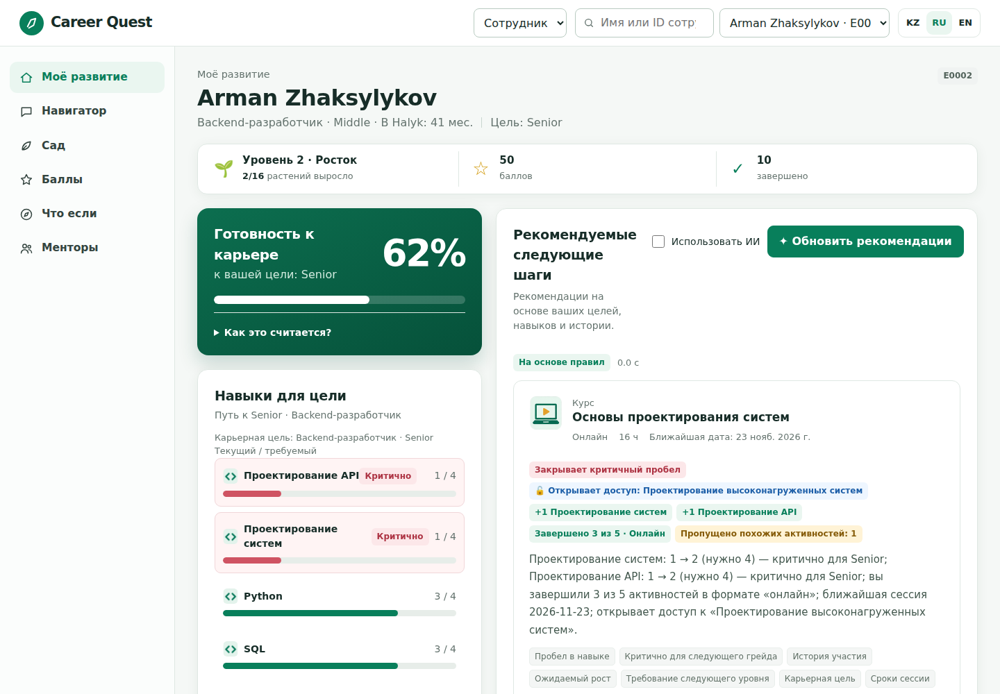
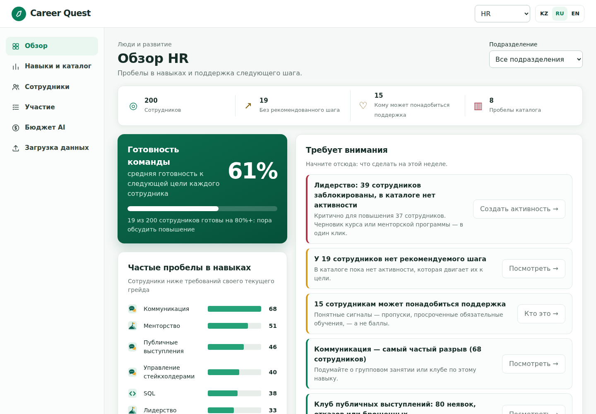
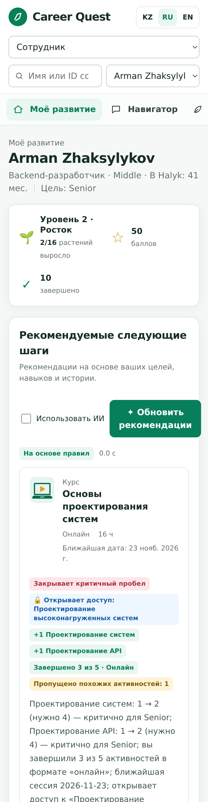
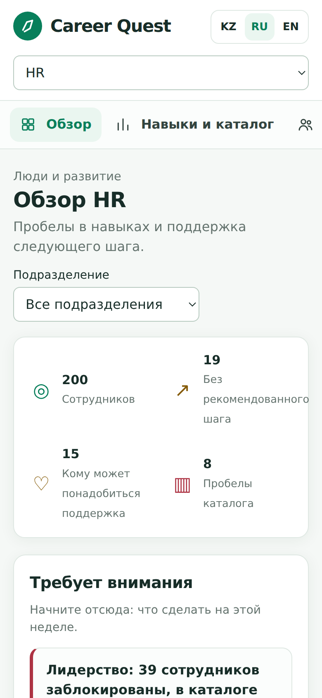
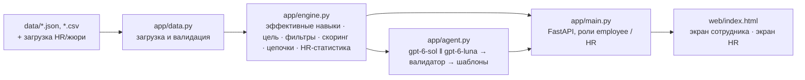

# Career Quest — AI-навигатор развития сотрудника

**Русский** · [English](README.en.md) · [Қазақша](README.kk.md)

HackAlem AI 2026 · **Track 03 · Management · кейс Career Quest (Halyk Bank)** — «платформа геймификации жизненного цикла сотрудника». Команда Nyanachi.

## Краткое описание

Сотрудник получает карьерные события разрозненными уведомлениями и не видит, куда ведёт каждая активность, поэтому обучение проходится формально. **Career Quest** показывает сотруднику путь к следующему грейду и предлагает 1–3 следующих шага с объяснением «почему именно это», опираясь на несколько факторов сразу: разрывы в навыках относительно требований следующего грейда, критичность навыка для повышения, историю участия (неявки, отказы, брошенные активности по форматам) и ожидаемый прирост навыка. HR видит, какие навыки отстают чаще всего, у кого нет доступного следующего шага и как проходят активности.

Пользователи: сотрудник со стажем 1–5 лет (основной) и HR / руководитель.

## Быстрый старт

```bash
git clone https://github.com/BAITC-Hacks/hack-34398b15-nyanachi.git
cd hack-34398b15-nyanachi
./run.sh                 # Python 3.12+; открыть http://127.0.0.1:8000
```

- Без API-ключа всё работает в режиме правил; для AI-обоснований — `cp .env.example .env` и указать `OPENAI_API_KEY`.
- Интерфейс открывается на английском; язык KZ / RU / EN переключается справа вверху. Названия кнопок ниже даны по-английски (в RU-интерфейсе: «Подобрать шаги», «Отметить завершённым»).
- Экран сотрудника: выбрать `E0001` → «Recommend next steps» → «Mark as done». Обоснования пишутся на языке сотрудника (`preferred_language`): у `E0001` это казахский, у `E0002` — русский.
- Экран HR: переключатель «View» → «HR», **пароль `hr-demo`** (переменная `HR_PASSWORD`).
- Проверка: `.venv/bin/python -m pytest -q` (26 тестов) и `.venv/bin/python -m eval.run_benchmark` (9/9).

## Скриншоты





Мобильная версия: сотрудник и HR:

<p>


</p>

## Что реализовано

Обязательные требования кейса:

| Требование | Где смотреть |
|---|---|
| Профиль и траектория: роль, грейд, навыки, пройденные активности, доступные шаги | Экран сотрудника: карточка «Career readiness» (процент готовности к цели), «Skills for target» — шкалы «текущий / требуемый», критичные навыки подсвечены |
| AI-рекомендация 1–3 следующих шагов | Кнопка «Recommend next steps» (`POST /api/employees/{id}/recommend`) |
| Объяснение минимум по 3 факторам | Текст обоснования + теги факторов + чипы с числами (разрыв, критичность, прирост, «завершено X из Y в этом формате») |
| Обновление прогресса | «Mark as done» → прирост навыка с учётом `max_level`, пересчёт готовности к грейду и рекомендаций |
| Простой HR-экран | Отстающие навыки, сотрудники без рекомендуемого шага (с причиной), участие по активностям |
| Загрузка дополнительных профилей и истории в формате датасета (минимальный профиль как в примере кейса — `employee_id, role, grade, tenure_months, skills` — тоже принимается) | HR-экран → загрузка `employees.json` / `activity_history.csv` (`POST /api/data/upload`) |
| Доступные следующие шаги на профиле | Список «Available next steps» с форматом, ближайшей сессией и приростом навыков |

Сверх обязательного:
- **AI-навигатор (чат с агентом)** — сотрудник спрашивает «почему этот шаг первый?», «кто может быть моим ментором?», «что нужно для Lead?». Агент (`gpt-6-sol`, function calling) сам вызывает инструменты движка — обзор профиля, рекомендации, варианты по навыку, объяснение активности, моделирование пути, менторы — и отвечает только по их результатам. Инструменты ограничены данными одного вошедшего сотрудника; в интерфейсе видно, какие инструменты использовались.
- **Как считается готовность** — раскрывающийся расчёт: засчитанные уровни / требуемые уровни и список недостающих уровней по навыкам.
- **«Не сейчас» с причиной** — «неудобный формат», «нет времени», «не интересно». Активность скрывается; причина «формат» снижает вес этого формата в следующих рекомендациях. Без штрафов — участие добровольное.
- **«Почему не очевидный выбор»** — объяснение, почему не выбран самый слабый навык (например, «вы трижды пропустили похожие активности, и навык не критичен для Senior»).
- **Цепочки пререквизитов** — если ценная активность закрыта пререквизитом, система рекомендует шаг, который её открывает («открывает доступ к Designing High-Load Systems»).
- **Разрывы, которые нечем закрыть** — критичные навыки, для которых в каталоге нет доступной активности; сотруднику предлагается обсудить менторство, HR видит пробел в каталоге.
- **Бенчмарк на ловушках** — 9 профилей, на которых правило «самый низкий навык» ошибается: базовое правило 0/9, Career Quest 9/9.
- Обоснования на языке сотрудника (kk / ru / en по `preferred_language`), интерфейс на KZ / RU / EN; названия 60 навыков, 40 активностей и 8 ролей переведены на казахский и русский (`web/i18n_names.json`, данные датасета не меняются).

Опциональные пункты кейса:
- **Моделирование перехода на грейд** — «Что если»: система берёт лучший шаг, применяет прирост навыков и планирует заново (до 5 шагов) с датами ближайших сессий по порядку. Пример: E0001 — готовность 54.5% → 75.8% к декабрю. Ничего не сохраняется.
- **Расширенный HR-дашборд** — фильтр по подразделению и «пробелы каталога»: навыки, нужные сотрудникам для цели, которые не может поднять ни одна доступная активность (например, Leadership нужен 39 сотрудникам и критичен для повышения 37, а курса нет).
- **Менторство** — для самых больших разрывов подбираются коллеги того же подразделения уровня Senior/Lead, сильные в этом навыке и готовые менторить (Mentoring ≥ 3 или пройден Mentor Track). Показываются только имя и роль, уровни навыков коллег не раскрываются.
- **Внутренняя валюта и награды** — баллы только за добровольные активности (+10 за активность, +10 за каждый поднятый уровень навыка), обязательные обучения баллов не дают; каталог наград и обмен баллов. Баланс видит только сам сотрудник.
- **Личные челленджи** — добровольная цель из смоделированного пути («достичь API Design 3 к 23 ноября»), +50 баллов при выполнении.
- **Конструктор активностей для HR** — в таблице «пробелы каталога» кнопка «Создать активность»: система заполняет черновик под роли и грейды заблокированных сотрудников (например, Leadership — 39 человек), HR правит и публикует, активность сразу попадает в рекомендации, пробел закрывается.
- **Кому нужна поддержка (вместо «риска увольнения»)** — HR видит понятные сигналы без скрытого балла: пропуски за год, просроченные обязательные обучения, нет завершённых активностей 6 месяцев, нет карьерной цели, долго Junior — и предложенное действие (спросить о формате, проверить нагрузку, предложить ментора, поговорить о целях). Только для HR.
- **Признание коллег** — «Поблагодарить» ментора из своего подразделения: получатель видит благодарность и +15 баллов; не больше 3 благодарностей в день и одной одному и тому же коллеге в неделю; ничего не публикуется.
- **Цель команды** — общий прогресс подразделения (завершённые добровольные активности за 90 дней против одной на человека), анонимно и без сравнения людей.
- **Скорость** — рекомендации сначала мгновенно в режиме правил, затем заменяются AI-версией; AI-ответ кэшируется по состоянию профиля и заранее подгружается при открытии профиля.
- **Сад навыков и уровень** — каждый навык цели показан растением, стадия роста = реальный уровень навыка (0–5); личный уровень (Seedling → Forest keeper) растёт с баллами. Сад можно показать коллегам своего подразделения только по взаимному согласию; рейтингов нет. Изображения растений сгенерированы `gpt-image-2.5` во время хакатона.
- Работа **без API-ключа** (режим правил) с шаблонными обоснованиями.

## Как работает решение


1. **Загрузка** стартового датасета (`data/`) и, при необходимости, дополнительных профилей и истории; схема проверяется Pydantic-моделями.
2. **Эффективные навыки.** Уровни навыков отражают последнюю аттестацию, поэтому к ним добавляется прирост от активностей, завершённых после `last_review_date` (с ограничением `max_level`).
3. **Цель.** `career_goal`, если задана (в том числе в другой роли), иначе следующий грейд текущей роли; у Lead без цели — критичные навыки текущего грейда.
4. **Фильтры доступности.** Исключаются обязательные активности, уже пройденные (кроме повторяемой `EV_036`), активности в процессе, не подходящие по роли/грейду, с невыполненными пререквизитами, без будущих сессий и без оставшегося прироста навыка.
5. **Скоринг** каждой доступной активности по прозрачной формуле (ниже) + бонус за открытие ценной активности через пререквизит.
6. **AI-слой.** `gpt-6-sol` получает 6 лучших кандидатов с посчитанными факторами и выбирает 1–3 шага, формулируя обоснование на языке сотрудника (Structured Outputs, строгая JSON-схема). Валидатор проверяет: 1–3 шага, только ID из списка кандидатов, ≥3 фактора на шаг. `gpt-6-luna` запускается параллельно как запасной вариант; если ни одна модель не ответила корректно за 8.5 с — используются шаблонные обоснования. Типичное время ответа 5–7 с (требование кейса ≤10 с).
7. **Прогресс.** «Mark as done» добавляет запись в историю, навыки и готовность пересчитываются.

### Надёжность рекомендаций

- Рекомендуются только полезные шаги — закрывающие разрыв к цели или открывающие такую активность; «1–3» означает до трёх, без заполнения мест бесполезным. Если полезных шагов нет, сотрудник видит «поговорите о менторстве», а HR — этого сотрудника с причиной.
- Активность, от которой сотрудник дважды отказался, больше не предлагается; повторяемый клуб (`EV_036`) засчитывается не чаще раза в день.
- Прирост от завершённых активностей учитывается один раз: отметка «выполнено» не переписывает дату аттестации, поэтому прирост не удваивается.
- AI может заявлять только факторы, которые действительно верны для активности (например, «критично для грейда» — только если шаг закрывает критичный разрыв). Неподтверждённые факторы отбрасываются; если осталось меньше трёх — используется шаблонное обоснование.
- Для смены роли (цель в другой роли) подходят базовые активности целевой роли до целевого грейда включительно.
- AI не может ухудшить выбор движка: в ответе обязан быть шаг с наибольшим score, нельзя выбирать избегаемый формат при наличии альтернативы, и хотя бы один фактор должен быть не производным от разрыва (история, формат, сроки, цель, критичность). Иначе — шаблонное обоснование.
- «Отметить выполненным» принимает только допустимые активности: повтор пройденной, обязательная, не своя роль/грейд или невыполненные пререквизиты — 422.
- Активности «в процессе» не рекомендуются заново, а показываются как «завершите начатое».
- На каждой карточке раскрывается «Why this ranking» — вклад каждой части формулы в итоговый score.
- 26 тестов; один из них проверяет всех 200 сотрудников и профили-ловушки: шаги допустимы, не обязательные, не повторные, детерминированы и имеют ≥3 подтверждённых фактора.

### Формула скоринга

```
полезный_прирост(навык) = min(новый_уровень, требуемый) − текущий        # новый_уровень = min(текущий + gain, max_level)
очки_разрыва = Σ полезный_прирост × (2, если навык критичен для цели, иначе 1)
надёжность   = 0.7 × доля_завершений(формат) + 0.3 × доля_завершений(тип)   # доля = (завершено+1)/(завершено+пропущено+2)
score = (очки_разрыва + 0.2 × прирост_сверх_требования) × (0.2 + 0.8 × надёжность)
        × 0.6, если формат избегается (≥3 пропуска и 0 завершений)
        × 0.9 / 1.05, если средняя оценка сотрудником такого типа активностей ≤2.5 / ≥4.5
        − 0.25 × max(0, пропуски_похожих − 1) − 0.01 × часы − 0.15, если ближайшая сессия дальше 90 дней
        + 0.5 × score_заблокированной_активности, если шаг открывает её пререквизит
готовность к цели, % = Σ min(уровень, требуемый) / Σ требуемый
```

## Технологии

- Python 3.12, FastAPI, Pydantic, Uvicorn
- OpenAI API: `gpt-6-sol` (основная модель), `gpt-6-luna` (быстрый запасной вариант), Responses API со Structured Outputs
- Интерфейс: один файл HTML/CSS/JS без сборки и внешних CDN (работает во внутреннем контуре)
- pytest

## Стоимость AI (оценка)

Токены измерены на реальных вызовах: одна AI-рекомендация ≈ 2 050 входных и ≈ 300 выходных токенов (`gpt-6-sol` + параллельный запасной `gpt-6-luna`), один вопрос навигатору ≈ 2 050 / 170 токенов (2–3 вызова модели в цикле инструментов). Цены: `gpt-6-sol` $2 / $10, `gpt-6-luna` $0.10 / $0.50 за 1 млн токенов.

| | На сотрудника в месяц | 40 сотрудников | 1 000 | 15 000 |
|---|---|---|---|---|
| Обычное использование: 8 новых AI-рекомендаций + 10 вопросов навигатору | ≈ $0.12 | ≈ $5 | ≈ $117 | ≈ $1 760 |
| Активное использование (×3) | ≈ $0.35 | ≈ $14 | ≈ $350 | ≈ $5 270 |
| Только `gpt-6-luna` (`OPENAI_MODEL=gpt-6-luna`) | ≈ $0.006 | < $1 | ≈ $6 | ≈ $87 |
| Режим правил (без ключа) | $0 | $0 | $0 | $0 |

- На HR-экране блок «AI budget» пересчитывает эти суммы для любой численности и показывает реально потраченные на этом сервере токены.
- Повторные просмотры не стоят денег: AI-ответ кэшируется по состоянию профиля, новый вызов — только после «выполнено», «не сейчас» или новой активности.
- Для закрытого контура: `OPENAI_BASE_URL` указывает на Qwen в vLLM внутри банка — фиксированная стоимость GPU вместо оплаты за токены, данные не покидают банк.

## Архитектура



```
app/config.py   настройки из окружения
app/data.py     модели данных, загрузка и слияние датасета
app/engine.py   детерминированное ядро: все числа, на которые опирается AI; путь к грейду, менторы, баллы, сад
app/agent.py    AI-выбор и обоснование, валидация, запасные варианты
app/chat.py     AI-навигатор: агент с инструментами поверх движка
app/main.py     REST API и разделение прав employee / HR
AGENTS.md       инструкция для AI-агентов (Codex, Claude Code): запуск, проверка, инварианты
web/index.html  интерфейс; web/garden/ — изображения стадий роста растений
eval/           профили-ловушки в формате датасета и бенчмарк
tests/          тесты ядра
data/           стартовый датасет организаторов
```

Права: `POST /api/login` выдаёт токен, подписанный HMAC (`APP_SECRET`). Сотрудник входит по своему ID (в рабочей системе — через SSO банка), HR — по паролю `HR_PASSWORD` (по умолчанию `hr-demo`). Каждый персональный эндпоинт требует токен в заголовке `Authorization: Bearer <токен>` или `X-Auth-Token: <токен>` (интерфейс использует второй, чтобы не конфликтовать с basic-auth прокси): без токена или с подделанным токеном — 401, сотрудник с чужим профилем или HR-данными — 403. Открыты только каталог (навыки, активности, .ics) и метаданные. Публичных рейтингов нет.

## Установка и запуск

Требования: Python 3.12+, Linux/macOS (или WSL), доступ в интернет для установки пакетов.

```bash
git clone https://github.com/BAITC-Hacks/hack-34398b15-nyanachi.git
cd hack-34398b15-nyanachi
./run.sh                 # создаёт .venv, ставит зависимости, запускает http://127.0.0.1:8000
```

Интерфейс: http://127.0.0.1:8000 · документация API: http://127.0.0.1:8000/docs

Экран HR открывается паролем **`hr-demo`** (меняется переменной `HR_PASSWORD`).

Без API-ключа приложение работает в режиме правил. Чтобы включить AI-обоснования:

```bash
cp .env.example .env     # и указать OPENAI_API_KEY
./run.sh
```

Порт и адрес можно поменять: `PORT=8080 HOST=0.0.0.0 ./run.sh`.

### Переменные окружения

| Переменная | По умолчанию | Назначение |
|---|---|---|
| `OPENAI_API_KEY` | пусто | Ключ OpenAI. Пусто — режим правил без AI |
| `OPENAI_MODEL` | `gpt-6-sol` | Основная модель |
| `OPENAI_FAST_MODEL` | `gpt-6-luna` | Запасная быстрая модель |
| `AI_TIMEOUT_S` | `8.5` | Бюджет времени на AI-ответ |
| `DATA_DIR` | `./data` | Папка с датасетом |
| `HR_PASSWORD` | `hr-demo` | Пароль HR-экрана |
| `APP_SECRET` | случайный при запуске | Ключ подписи токенов (задайте, чтобы токены переживали перезапуск) |
| `OPENAI_BASE_URL` | пусто | Любой OpenAI-совместимый сервер: OpenRouter или vLLM внутри контура банка. Пусто — api.openai.com |
| `AI_REASONING` | `none` | Уровень рассуждений модели (скорость ответа) |
| `CHAT_TIMEOUT_S` | `20` | Бюджет времени на ответ навигатора |

### Зависимости

`requirements.txt`: fastapi, uvicorn, python-multipart, pydantic, openai, python-dotenv, pytest (версии закреплены).

## Как проверить решение

**1. Тесты и бенчмарк (без ключа):**

```bash
.venv/bin/python -m pytest -q                 # 26 тестов
.venv/bin/python -m eval.run_benchmark        # режим правил: Baseline 0/9 · Career Quest 9/9
.venv/bin/python -m eval.run_benchmark --ai   # с AI (нужен ключ): тоже 9/9
```

**2. Сценарий сотрудника в интерфейсе** (числа ниже — для только что запущенного сервера: отметки «выполнено» и загрузки хранятся в памяти до перезапуска):
1. Открыть http://127.0.0.1:8000, режим «Employee», выбрать `E0001` (Backend Engineer, Junior → Middle, готовность 54.5%).
2. Нажать «Recommend next steps». В режиме правил ожидаются `System Design Fundamentals` (с чипом «Closes a critical gap» и «Unlocks Designing High-Load Systems»), `Cloud Certification Prep`, `Public Speaking Club`. С ключом — выбор и формулировки от `gpt-6-sol`.
3. Нажать «Mark as done» у первого шага — шкалы System Design и API Design и процент готовности в карточке «Career readiness» растут.

**3. Загрузка профилей, как на защите:** режим «HR» (пароль `hr-demo`) → загрузить `eval/trap_employees.json` и `eval/trap_history.csv` → выбрать сотрудника `E9103` (пропускает офлайн-занятия). Ожидается первым шагом онлайн-активность `Architecture Review Circle`, а не офлайн-воркшоп по той же теме. Быстрее: HR → «Upload data» → «Load example data» загружает эти же файлы одной кнопкой и показывает кнопки открытия добавленных профилей; там же ссылки на файлы-примеры (`GET /api/data/examples/employees.json`, `.../activity_history.csv`).

Форматы загрузки, чтобы файлы жюри принимались как есть: профили — файл стартового набора `{"employees": [...]}`, список профилей или один объект профиля, как в примере кейса; навыки — по ID (`SK_SYSTEM_DESIGN`) или по названию (`System Design`). История — CSV с разделителем `,` или `;`, с BOM из Excel или без; обязательны только `employee_id, event_id, date, status`. Если загружен изменённый профиль с уже существующим ID (например, `E0028` из примера кейса), его история из стартового датасета больше не учитывается — профиль оценивается по загруженной истории (порядок загрузки файлов не важен). Ошибки (неизвестная роль, навык или активность) возвращаются понятным сообщением 422.

Принимается и минимальный профиль, как в примере кейса (остальные поля заполняются значениями по умолчанию), — JSON-список или `{"employees": [...]}`:

```json
[{"employee_id": "E9999", "role": "Backend Engineer", "grade": "Junior",
  "tenure_months": 14, "skills": {"SK_PYTHON": 2, "SK_SQL": 1}}]
```

**4. Опциональные функции (без ключа):** на экране сотрудника `E0001` пункты левого меню и вкладки внизу страницы — «What if» (путь к грейду: 54.5% → 75.8% к декабрю), «Mentors», «Points» (принять челлендж, обменять баллы), «Garden» (после «Mark as done» растения растут). На HR-экране (пароль `hr-demo`) — фильтр подразделения, «Catalogue gaps» с кнопкой «Create activity» и блок «Who may need support». У ментора — «Say thanks».

**5. Навигатор (нужен `OPENAI_API_KEY`):** вкладка «Navigator» («Ask your navigator») → «Why is this my first step?». В ответе — ссылки на реальные активности и строка «Checked: …» с вызванными инструментами. Без ключа эндпоинт возвращает 503 с понятным сообщением, остальное приложение работает.

**6. Через API** (сначала получить токены):

```bash
login() { curl -s -X POST http://127.0.0.1:8000/api/login -H "Content-Type: application/json" -d "$1" \
          | python3 -c "import json,sys; print(json.load(sys.stdin)['token'])"; }
EMP=$(login '{"role":"employee","employee_id":"E0001"}')
HR=$(login '{"role":"hr","password":"hr-demo"}')

curl -X POST "http://127.0.0.1:8000/api/employees/E0001/recommend?ai=false" -H "Authorization: Bearer $EMP"
curl -X POST http://127.0.0.1:8000/api/employees/E0001/complete -H "Authorization: Bearer $EMP" \
     -H "Content-Type: application/json" -d '{"event_id":"EV_005"}'
curl http://127.0.0.1:8000/api/employees/E0001/path    -H "Authorization: Bearer $EMP"
curl http://127.0.0.1:8000/api/employees/E0001/mentors -H "Authorization: Bearer $EMP"
curl http://127.0.0.1:8000/api/employees/E0001/wallet  -H "Authorization: Bearer $EMP"
curl http://127.0.0.1:8000/api/employees/E0001/garden  -H "Authorization: Bearer $EMP"
curl -X POST http://127.0.0.1:8000/api/employees/E0001/chat -H "Authorization: Bearer $EMP" \
     -H "Content-Type: application/json" -d '{"message":"Why is this my first step?"}'
curl http://127.0.0.1:8000/api/hr/summary -H "Authorization: Bearer $HR"
curl "http://127.0.0.1:8000/api/hr/summary?department=Sales" -H "Authorization: Bearer $HR"
curl -X POST http://127.0.0.1:8000/api/data/upload -H "Authorization: Bearer $HR" \
     -F employees=@eval/trap_employees.json -F history=@eval/trap_history.csv
curl -o /dev/null -w "%{http_code}\n" http://127.0.0.1:8000/api/hr/summary   # 401 без токена
```

## Бенчмарк на профилях-ловушках

| Ловушка | Правило «самый низкий навык» | Career Quest |
|---|---|---|
| Самый слабый навык (Public Speaking) трижды пропущен, критичен System Design | ❌ Public Speaking Club | ✅ шаг по System Design |
| Уровень Cloud устарел: сертификация пройдена после аттестации | ❌ Cloud Certification Prep | ✅ не тратит шаг на уже закрытый навык |
| Критичный разрыв в System Design, сотрудник не ходит офлайн | ❌ | ✅ онлайн Architecture Review Circle |
| Цель — Data Analyst, а не Senior Backend | ❌ | ✅ навыки аналитика |
| Ценные активности закрыты пререквизитом | ❌ | ✅ System Design Fundamentals как открывающий шаг |
| Курс упирается в `max_level`, уровень уже максимальный | ❌ | ✅ курс без прироста не рекомендуется |
| Устаревший навык **и** избегание офлайна одновременно | ❌ | ✅ онлайн-шаг по System Design, не Cloud |
| Lead с целью Data Analyst Senior (смена роли) | ❌ | ✅ Applied Statistics — основа критичного навыка |
| Нет истории участия вообще | ❌ | ✅ шаг по критичному разрыву |
| **Итого** | **0/9** | **9/9** (и в режиме правил, и с AI) |

## Данные и интеграции

- `data/` — синтетический стартовый датасет организаторов (200 сотрудников, 40 активностей, 60 навыков, 2 743 записи истории, дата среза 2026-10-01). Включён только для проверки решения, не для распространения.
- `eval/` — наши синтетические профили-ловушки в той же схеме.
- Внешний сервис: OpenAI API (только для формулировки рекомендаций; модель получает профиль одного сотрудника без ФИО и уже посчитанные факторы). Без ключа не используется.
- Реальные персональные данные не используются.

## Deployed-версия (демо)

Демо с настроенным AI-ключом: https://kitan-a.com/careerquest/ — закрыто паролем, так как содержит данные кейса.

| | |
|---|---|
| Вход на страницу (окно браузера) | логин `judge`, пароль `drynsDhqCPsV` |
| Экран HR внутри приложения | пароль `hr-demo` |

Демо работает на последнем коммите этого репозитория и перезапускается с чистыми данными датасета; загрузки и отметки «выполнено» хранятся до перезапуска. Для самостоятельной проверки без наших учётных записей достаточно `./run.sh` (режим правил) или собственного `OPENAI_API_KEY`.

## Ограничения

- Вход демо-уровня: сотрудник выбирает свой ID, HR вводит пароль; токены подписаны HMAC. Подключение к SSO банка (Azure AD / Keycloak) — замена эндпоинта `/api/login`, остальная проверка прав не меняется.
- Данные хранятся в памяти процесса: загрузки и отметки «выполнено» сбрасываются при перезапуске.
- Отметка «выполнено» делается самим сотрудником (как требует сценарий кейса); в рабочей системе факт завершения должен приходить из LMS или подтверждаться руководителем, прежде чем начислять баллы.
- Баллы, челленджи, обмены и настройки «поделиться садом» хранятся в памяти процесса и сбрасываются при перезапуске.
- Каталог наград и пороги уровней заданы в коде как пример; в реальной системе их настраивает HR.
- Веса формулы скоринга подобраны вручную на датасете и профилях-ловушках, без обучения на реальных исходах.
- Интеграций с HRIS и мессенджерами нет; календарь — только экспорт `.ics` (кнопка «Add to calendar»), без синхронизации.

## Использованные компоненты и AI-инструменты

- Открытые библиотеки из `requirements.txt` (лицензии MIT/BSD/Apache-2.0).
- До 13:00 в репозиторий были отправлены только проверка доступа (`.gitignore`, `.env.example`), небольшой шаблон-заготовка (Streamlit + пример вызова OpenAI, ~200 строк) и примеры вызова API. Они не относятся к кейсу и удалены после 13:00; вся логика Career Quest (движок, AI-слой, API, интерфейс, тесты) написана во время соревновательной части — это видно по истории коммитов.
- Разработка с помощью AI-агентов: Claude Code (Anthropic) и Codex (OpenAI); Codex также использовался для черновика интерфейса и тестирования страницы. Иллюстрации (иконки, растения сада, схема пайплайна) сгенерированы `gpt-image-2.5` во время хакатона.
